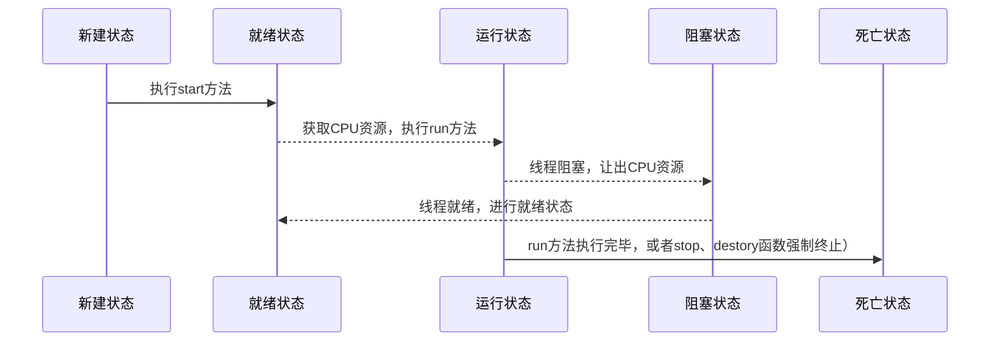

## 生命周期
线程是一个动态执行的过程，它也有一个从生产到死亡的过程。
1. 新建状态
    使用 `new` 关键字和 `Thread` 类或其子类建立一个线程对象后，该线程对象就处于新建状态。它保持这个状态直到程序 `start()` 这个线程。
1. 就绪状态
    当线程对象调用了 `start()` 方法之后，该线程就进入就绪状态。就绪状态的线程处于就绪队列中，要等待 JVM 里线程调度器的调度。
1. 运行状态
    如果就绪状态的线程获取 CPU 资源，就可以执行 `run()`，此时线程便处于运行状态。处于运行状态的线程最为复杂，它可以变为阻塞状态、就绪状态和死亡状态。
1. 阻塞状态
    如果一个线程执行了 `sleep`（睡眠）、`suspend`（挂起）等方法，失去所占用资源之后，该线程就从运行状态进入阻塞状态。在睡眠时间已到或获得设备资源后可以重新进入就绪状态。可以分为三种：

    等待阻塞：运行状态中的线程执行 `wait()`方法，使线程进入到等待阻塞状态。

    同步阻塞：线程在获取 `synchronized` 同步锁失败(因为同步锁被其他线程占用)。

    其他阻塞：通过调用线程的 `sleep()` 或 `join()` 发出了 I/O 请求时，线程就会进入到阻塞状态。当 `sleep()` 状态超时，`join()` 等待线程终止或超时，或者 I/O 处理完毕，线程重新转入就绪状态。
1. 死亡状态:
    一个运行状态的线程完成任务或者其他终止条件发生时，该线程就切换到终止状态。



## 创建线程的几种方法
Java 提供了三种创建线程的方法：
1. 通过继承 `Thread` 类本身。
1. 通过实现 `Runnable` 接口。
1. 通过 `Callable` 和 `Future` 创建线程。

三种创建线程的方法的对比：
1. 采用实现 `Runnable`、`Callable` 接口的方式创建多线程时，线程类只是实现了 `Runnable` 接口或 `Callable` 接口，还可以继承其他类。
1. 使用继承 `Thread` 类的方式创建多线程时，编写简单，如果需要访问当前线程，则无需使用 `Thread.currentThread()` 方法，直接使用 `this` 即可获得当前线程。

#### 通过实现 `Runnable` 接口来创建线程。
```java
public class Test1 implements Runnable{
    @Override
    public void run() {
        System.out.println("Hello World");
    }

    public static void main(String[] args) {
        new Thread(new Test1()).start();
    }
}
```

#### 通过继承 `Thread` 来创建线程。
```java
public class Test1 extends Thread{
    @Override
    public void run() {
        System.out.println("Hello World");
    }

    public static void main(String[] args) {
        new Test1().start();
        System.out.println("123");
    }
}
```

#### 通过 `Callable` 和 `Future` 创建线程
整个流程如下：
1. 创建 `Callable` 接口的实现类，并实现 `call()` 方法，该 `call()` 方法将作为线程执行体，并且有返回值。
2. 创建 `Callable` 实现类的实例，使用 `FutureTask` 类来包装 `Callable` 对象，该 `FutureTask` 对象封装了该 `Callable` 对象的 `call()` 方法的返回值。
3. 使用 `FutureTask` 对象作为 `Thread` 对象的 target 创建并启动新线程。
4. 调用 `FutureTask` 对象的 `get()` 方法来获得子线程执行结束后的返回值。
## yield 关键字