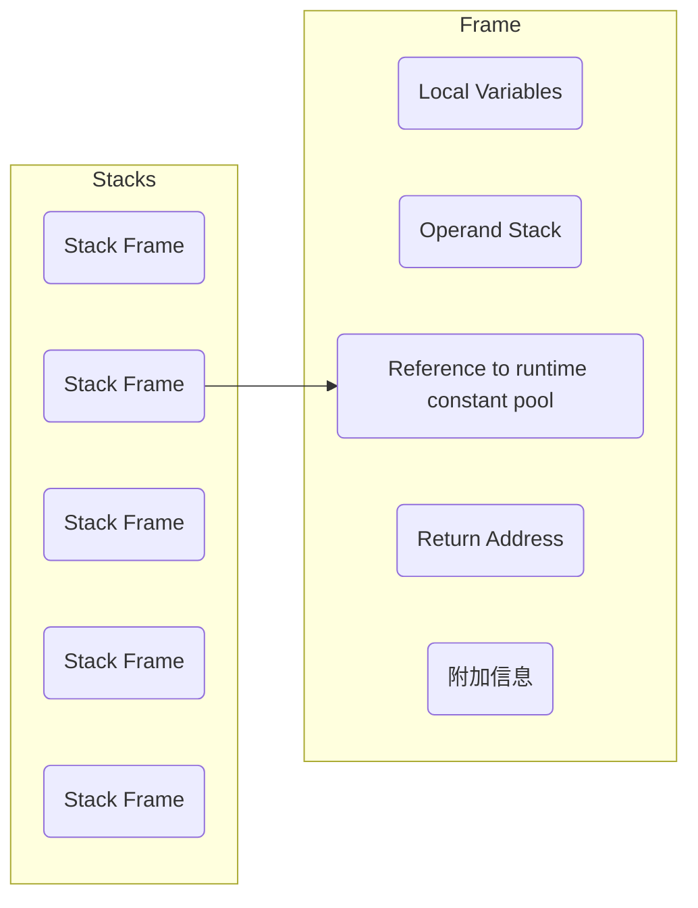

The Java Virtual Machine defines various (各种不同的) run-time data areas that are used during execution of a program. Some of these data areas are created on Java Virtual Machine start-up and are destroyed only when the Java Virtual Machine exits. Other data areas are per thread. Per-thread data areas are create when a thread is created and destroyed when the thread exits.

## The PC Register
The Java Virtual Machine can support many threads of execution at once. Ecah Java Virtual Machine thread has it own PC (Program Counter) register. At any point, each Java Virtual Machine thread is executing the code of a single method, namley the current method for that thread. If that method is not *native*, the PC register contains the address of the Java Virtual Machine instruction (指令) currently being executed.

## Stacks
Each Java Virtual Machine thread has a **private** Java Virtual Machine stack, created at the same time as the thread. A Java Virutal Machine stack stores **frames**. A Java Virtual Machine stack is anaiogous (相似的) of the stack of a conventional (传统的) language such as C: it holds local variables and partial (部分) results, and plays a part in (用在参加某活动时，作为其中的一员，一部分) method invocation (调用) and return. Because the Java Virutal Machine stack is never manipulated (控制) directly except to push and pop frames, frames may be heap allocated. The memory for a Java Virtual Machine stack does not need to be contiguous (相邻的).

This specification (规范) permits (允许) Java Virtual Machine stacks either to be of a fixed size or to dynamically expand and contract (收缩) as required by the conputation. If the Java Virtual Machine stacks are of a fixed size, the size of each Java Virtual Machine stack may be chosen independently when that stack is created.

> A Java Virtual Machine implementation may provide the programmer or the user control over the initial size of Java Virtual Machine stacks, as well as, in the case of dynamically expanding or contracting Java Virtual Machine stacks, control over the maximum and minimum sizes.

The following exceptional (特殊的) conditions are associated (有关联) with Java Virtual Machine stacks:
- If the computation in a thread requires a larger Java Virtual Machine stack than is permitted, the Java Virtual Machine throws a `StackOverflowError`.
- If Java Virtual Machine stacks can be dynamically expanded, and expansion is attempted but in sufficient (不足的) memory can be made available to effect the expansion, or if insufficient memory can be make available to create the initial Java Virtual Machine stack for a new thread, the Java Virtual Machine throws an `OutOfMemoryError`.

## Heap
The Java Virtual Machine has a heap that is **shared** among all Java Virtual Machine threads. The heap is the run-time data area from which memory for all classes instances and arrays is allocated.

The heap is created on virtual machine start-up. Heap stroage for objects is reclaimed (再生) by an automatic storage management (known as a garbage collector); objects are never explicitly (明确) deallocated (被释放). The Java Virtual Machine assumes (假定) no particular (特别的) type of automatic storage management sytem, and the storage management technique may be chosen according to the implementor's system requirements. The heap may be of a fixed size or may be expanded as required by the computation and may be contracted if a larger heap becomes unnecessary. The memory for the heap dost not need to be contiguous (相接).

> A Java Virtual Machine implementation may provide the programmer or the user control over the initial size of the mothod area, as well as, in the case of a varying-size method area, control over the maxinum and mininum method area size.

The following exceptional condition is associated with the heap:
- If a computation requires more heap than can be make available by the automatic sorage managment system, the Java Virtual Machine throws an `OutOfMemoryError`.

## Method Area
The Java Virtual Machine has a method area that is **shared** among all Java Virtual Machine threads. The method area is analogous (相似的) to the storage area for complied code of a conventional language or analogous to the "text" segment (部分) in an operating system process.

The method area is created on virutal machine start-up. Although the method area is logically part of the heap, simple implementations may choose not to either garbage collect or compact it. The specification (规范) does not mandate (授权) the location of the method area or the policies (政策) used to manage complied code. The method area may be of a fixed size or may be expanded as required by the computation and may be contracted if a larger method area becomes unnecessary. The memory for the method area does not need to be contiguous.

> A Java Virutal Machine implementation may provide the programmer or the user control over the initial size of the method area, as well as, in the case of a varying-size method area, control over the maximum and minimum method area size.

The following exceptional condition is associated with method area:
- If memory in the mothod area cannot be made a avaliable to satisfy (使满意) an allocation request, the Java Virtual Machine throws an `OutOfMemoryError`.

### Run-Time Constant Pool
A run-time constant pool is a per-class or per-interface run-time representation of the constant_pool table in a class file. It contants serveral kinds of constatnts, ranging from numeric literals known at complie-time to method and field reference that must be resolved at run-time. The run-time constant pool serves a function similar to that of a symbol table for a conventional programming language, although it contanins a wider range of data than a typical symbol table.

Each run-time constant pool is allocated from the Java Virtual Machine's method area. The run-time constant pool for a class or interface is constructed wwhen the class or interface is created by the Java Virtual Machine.

The folloing exception condition is assoiated with the construction (构造) of the run-time constant pool for a class or interface:
- When creating a class or interface, if the construction of the run-time constant pool requires more memory than can be avaliable in the method area of the Java Virtual Machine, the Java Virtual Machine throws an `OutOfMemoryError`.

## Native Method Stacks
An implementation of the Java Virtual Machine may use conventional stacks, colloquially (通俗地) called "C stack" to support *native* methods (methods written in a language other than the Java programming language). Native method stacks may also be used by implementation of an interpreter (解释器) for the Java Virtual Machine's instruction set in a language such as C. Java Virtual Machine implementations thant cannot load *native* methods and that do not themselves rely on conventional stacks need not supply native method stacks. If supplied, native method stacks are typically allocated per thread when each thread is created.

The specification permits native method stacks either to be of a fixed size or to dynamically expand and contract as required by the computation. If the native method stacks are of a fixed size, the size of each native method stack may be chosen independently when that stack is created.

> A Java Virtual Machine implementation may provide the programmer or user control over (控制) the native mthod stacks, as well as, in the case of varying-size nativve method stacks, control over the maximum and minimum method stack sizes.

The following exceptional conditions are associated with native method stacks:
- If the computation in a thread requires a larger native method stack than is permitted, the Java Virtual Machine throws a `StackOverflowError`.
- If native method stacks can be dynamically expanded and native method stack expansion is attempted bu insufficient memory can be made available, or if insufficient memory can be made avaliable to create the inital native method stack for a new thread, the Java Virtual Machine throws an `OutOfMemoryError`.