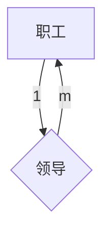
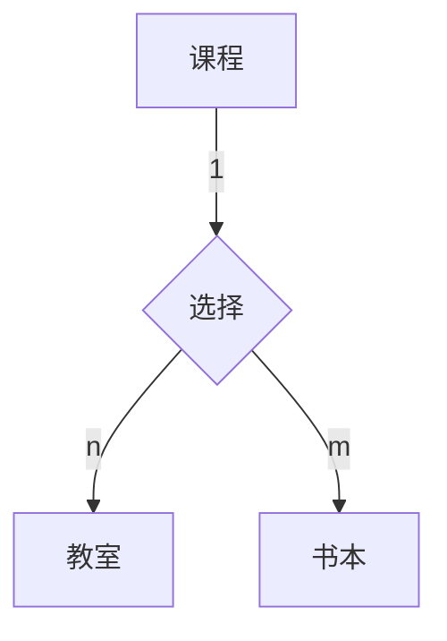

MySQL 概述
MySQL 安装
MySQL 数据类型
MySQL 数据索引
MySQL 常用函数
MySQL 操作语句
MySQL 查询语句
MySQL 存储引擎
MySQL 锁定机制
MySQL 事务机制
MySQL 备份恢复
MySQL 读写分离
MySQL 性能调优

## 三大范式
为了建立冗余较小、结构合理的数据库，设计数据库时必须遵循一定的规则。在关系型数据库中这种规则就称为范式。范式是符合某一种设计要求的总结。要想设计一个结构合理的关系型数据库，必须满足一定的范式。

1. 第一范式：确保每列保持原子性
   第一范式是最基本的范式。如果数据库表中的所有字段值都是不可分解的原子值，就说明该数据库表满足了第一范式。

   第一范式的合理遵循需要根据系统的实际需求来定。比如某些数据库系统中需要用到“地址”这个属性，本来直接将“地址”属性设计成一个数据库表的字段就行。但是如果系统经常会访问“地址”属性中的“城市”部分，那么就非要将“地址”这个属性重新拆分为省份、城市、详细地址等多个部分进行存储，这样在对地址中某一部分操作的时候将非常方便。这样设计才算满足了数据库的第一范式。
1. 第二范式：确保一个表中只能保存一种数据
   在数据库中，一个表中只能保存一种数据，不可以把多种数据保存在同一张数据库表中。

   比如要设计一个订单信息表，因为订单中可能会有多种商品，所以要将订单编号和商品编号作为数据库表的联合主键。这样就产生一个问题：这个表中是以订单编号和商品编号作为联合主键。这样在该表中商品名称、单位、商品价格等信息不与该表的主键相关，而仅仅是与商品编号相关。所以在这里违反了第二范式的设计原则。而如果把这个订单信息表进行拆分，把商品信息分离到另一个表中，把订单项目表也分离到另一个表中，就非常完美了。、

1. 第三范式：确保每列都和主键列直接相关，而不是间接相关
   比如在设计一个订单数据表的时候，可以将客户编号作为一个外键和订单表建立相应的关系。而不可以在订单表中添加关于客户其它信息（比如姓名、所属公司等）的字段。


## E-R 图
全称为实体联系模型、实体关系模型或实体联系模式图，由美籍华裔计算机科学家陈品山发明，是概念数据模型的高层描述所使用的数据模型或模式图。也就是说，我们可以通过 E-R 图，对信息世界进行建模，对现实世界进行第一层抽象。说白了就是用图的方式描述事物的属性和事物之间的关系！

#### 信息世界的基本概念
1. 实体
   客观存在并可相互区别的事物。实体可以是具体的人、事、物，也可以是抽象的概念或联系。比如一个学生、一门课、老师与学院的工作关系等都属于实体。
1. 属性
   实体所具有的某一特性。一个实体可以由多个属性来刻画。这个应该很好理解，就像人的实体有名字，身高，体重，出生年月等等。这些属性组合起来表征一个人。
1. 码
   唯一标识实体的属性集称为码。例如学生的学号就唯一标识了学生实体，还有我们的身份证唯一标识了我们。
1. 域
   域是一组具有相同数据类型的值和集合。属性的取值范围来自某个域。比如，姓名的域是字符串集合，年龄的域是整数，性别的域为（男，女）。
1. 实体型
   具有相同属性的实体必然具有共同的特征和性质。用实体名以及其属性名集合来抽象和刻画同类实体，称为实体型。举个栗子：学生（学号、姓名、性别、出生年月、所在院系、入学时间）就是一个实体型。
1. 实体集
   同一类实体的集合就是实体集。比如：全体学生就是一个实体集。
1. 联系
   现实世界中，事物内部及事物之间的关系，反映在信息世界中即是实体（型）内部的联系和实体（型）之间的联系。实体内部的联系通常指实体各属性之间的联系；实体间的联系通常指不同实体集之间的联系。

#### 事物之间的关系
首先是两个实体型之间的联系，几乎所有复杂的联系，都可以简化为好几个两个实体集之间的联系，所以我们先讨论两个实体型之间的联系。

两个实体型之间的联系可以分为三类：
1. 一对一联系
   对于实体集A中每一个实体，实体集B中最多有一个（也可以没有）实体与之联系，反之亦然，则称实体集A和实体集B具有一对一联系。

   举个梨子：一般来说，一个班级只有一个正班长，且一个班长只在一个班中任职，所以我们说班长和班级之间具有一对一联系。

1. 一对多联系
   实体集A中每一个实体，实体集B中有n个实体（n‎ ≥ 0）与之联系，反之，B中的每一个实体，实体集A中至多只有一个与之联系，则称实体集A与实体集B具有一对多联系。

   举个苹果：一般来说，一个班级中有若干个学生，而每个学生只在一个班级中学习，则班级与学生之间具有一对多的联系。

1. 多对多联系
   因该不难推测，多对多就是实体集A中每一个实体，在实体集B中有n（n ‎≥ 0）个与之联系，反正实体集B中每一个实体，A中也有m（m ‎≥ 0）个实体与之联系。我们则称A与B具有多对多联系。

   举个香蕉：一门课程同时有若干个学生选修，一个学生一次可以选择若干门课程，所以课程与学生之间的联系属于多对多的联系。

单个实体型内的联系：
1. 我们首先要知道，单个实体型之间也是存在一对一，一对多和多对多的联系的。例如职工实体型就有领导和被领导的联系，一般来说这是一种一对多的联系，一名领导领导多名员工，多名员工被一个领导领导。
1. 在我们实际生活中，更多的是多个实体集之间的联系，由于可以存在多个实体集之间有着共同的关系，所以当我们要描述的问题比较大的时候，很难用语言来描述其中的关系，我们需要一种能够简化这种关系，让我们简单清楚的发现其中的关系的一种方法，所以才有了E-R图。

#### E-R 图的组成
1. 矩形框
   表示实体，在框中记入实体名。
1. 菱形框
   表示联系，在框中记入联系名。
1. 椭圆形框
   表示实体或联系的属性，将属性名记入框中。对于主属性名，则在其名称下划一下划线。
1. 连线
   实体与属性之间；实体与联系之间；联系与属性之间用直线相连，并在直线上标注联系的类型。（对于一对一联系，要在两个实体连线方向各写1； 对于一对多联系，要在一的一方写1，多的一方写N；对于多对多关系，则要在两个实体连线方向各写N, M)。

两个实体，一对一联系：


两个实体，一对多联系：


两个实体，多对多联系：


单个实体之间一对多实例：



三个实体之间：



## 概要
1. 怎样才能找出最后一次插入时分配了哪个自动增量
1. MySQL 有关权限的表都有哪几个

1. 如何通俗地理解三个范式
1. 数据库三范式及判断、E-R 图
1. MySQL范式和反范式的区别以及彼此的优缺点
1. 数据库的范式


## 表与视图
1. 什么是基本表
1. 什么是视图
1. 什么是游标
1. 试述视图的优点
1. 什么叫视图，游标是什么
1. 完整性约束包括哪些
1. drop、truncate、delete 区别


## 常见问题
1. 抛出异常 java.sql.SQLException: Incorrect string value: '\xF0\x9F\x92\x94' for column 'name' at row 1

数据库字段、表、数据库、MySQL 的编码需要设置成utf8mb4、数据库连接设置编码

```sql
show variables like "%char%";
```

我的问题是，阿里云数据的chareacer_set_server=utf8，修改即可。