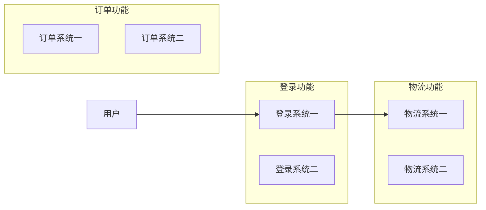

## 单点登录
简单来说，单点登录（SSO）就是在多个系统中，用户只需一次登录，各个系统即可感知该用户已经登录。

```mermaid
graph LR
    subgraph 订单功能
        订单系统一 
        订单系统二
    end

    subgraph 登录功能
        登录系统一 
        登录系统二
    end

    subgraph 物流功能
        物流系统一 
        物流系统二
    end

    用户 --> 登录系统一

    登录系统一 --> 物流系统一

```