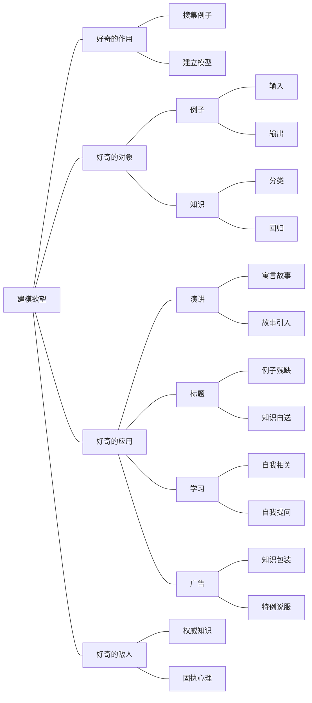

思维导图是我在研究深度学习后才明白它原理的，因为思维导图和人工智能的深度学习原理一样。如果我学其他专业的话，恐怕我一辈子都不知道原理。所以非机器学习专业的人很少有能解释思维导图的原理，为何有效，何时无效。

## 思维导图的作用
先来看看思维导图最牛的作用是什么。

> 学习上：思维导图可以让你用更少的例子学会知识

再直白点说：你只做过几道题，但可通过思维导图来学会别人用题海战术才能学会的知识，是学得快；用了题海战术更厉害，是学得好。

> 应用上：思维导图可以让你用更少的知识解决问题

再直白点说：用思维导图就可以解决你从来没遇到过的复杂问题。

关键在于：更少更快。

## 思维导图的原理
可关键的问题是：为什么？是仪式产生的魔法？到底是怎么做到上面两点的？原理是什么？下面是用人工智能理论借鉴而来的原理解释为什么思维导图能做到这些。

### 什么是学习

## 促进学习的关键是什么？

事实上，好奇心和食欲、性欲一样，是人类的基本欲望。和好奇心相关的大脑区域就是负责奖励机制的伏膈核，也正是对成瘾行为起重要作用的区域。因为我们不得不依赖自己的模型而存活，所以一定会想尽办法的去建立模型（学习），而好奇心便是演化出来促进学习的奖励机制，每个人生下来就是一部终身好奇的学习机器。

我们不是不喜欢学习，而是不喜欢不符合大脑特点的记忆。当我们对食物饥饿时，大脑会产生进食欲，会无法抑制的想要进食。学习和进食一样，当我们对知识饥饿时，大脑会产生求知欲，也会无法抑制的想要学习。

> 若善用好奇心，将会对学习起到非常显著的作用

## 万能学习法！
大家一定想过有没有一个万能学习法？有。

而且还是被证明了定理：叫做无免费午餐定理（别名叫做：没有万能学习法）

显式知识的思维导图也好，隐式知识的端到端学习也好，都有它适用的场合，切勿认为思维导图是万能的，它就不适合隐式知识的学习。

任何一个声称自己是万能学习法的，无一例外都是骗子。网上有很多的学习方法，但很少有提及某个学习方法不适合什么任务。

#### test1
我有个朋友兼前同事是一半波兰一半俄国人。我认识他是在我的第一份工作中。当时他的最大特点就是戴上大耳机听古典音乐编程，绝对不要没事打扰他。工作内容是一个政府给学生网上考试的系统，每个考试都有三到四个阶段，每一阶段都是根据前一阶段的回答来给的题目。反正当时是个教授从政府那拿到了巨额拨款，自己算出了专门出题的algorithm，要把这转化为一个政府的线上考试学习系统。然后我的这位同事/朋友只是因为兴趣爱好而已花了一个周末也不拿加班费就把那段复杂的algorithm转化为代码，那段代码跑了五年以后才发现了一个bug。后来他就跑去别的公司做了几年就被海军招去做研究，按他的话说是大公司的编程太没劲了，都是一样的原理没挑战，我还是喜欢数学。现在一边上班一边读纯数学的phd都快是最后阶段了。他就是喜欢钻研的那种人，咖啡狂人，然后各种学术文件拿来当小说读，还爱吐槽政治，最重要的就是知道自己喜欢什么一定要去做，一但开始就沉浸其中，高度集中，极强的自制力，屁股坐上椅子一定等解决问题了才起来（喝咖啡除外），甚至可以不吃饭。

看到这么多人说俄罗斯人数学好，我也来强答一个！俄罗斯人数学是真心好，更厉害的是他们对知识非常严谨以及求知欲非常旺盛。说个小事吧，研究生教我们随机过程的教授是前苏联的，曾师从吉米多维奇，有次做衍生品定价的小论文答辩，是他和一位希腊大叔在听，希腊大叔问了几个问题就再没有提问的欲望，大神估计对金融衍生品比较感兴趣，一直在草稿纸上画，不停地提问，希腊大叔表示可以了，差不多得了。大神一脸好奇宝宝的样子说:"不行不行，我这里这里这里还没有听明白。"以他在数学上的学识，对一个水货研究生的水货小论文都能这么认真听完以及提问，我还没遇到第二位能做到这样的教授。还有对于没有好好做论文深感惭愧！
