流程图（flow chart）是使用图形表示算法思路的一种方法。在HEXO中我们可以使用`hexo-filter-mermaid-diagrams`插件来实行流程图，它的显示结果非常漂亮优雅。

## HEXO使用hexo-filter-mermaid-diagrams

设置最大高度，及居中展示：
```css
/*目录themes/next/source/css/_custom/custom.styl下面加入如下自定义样式*/
/*mermaid限制高度，居中*/
.mermaid {
text-align: center;
max-height: 300px;
}

/*设置文字为白色*/
.messageText {
fill: #fff !important;
}

/*表格沾满行*/
body table {
display: table !important;
}
```

## 三种基本线型及扩展
节点之间通过连线来连接，一共有3种线的形状：虚线（-.-）、实线（---）、粗实线（===）。

```
# 注明类型：mermaid
graph TB
A1 -.- B1
A2 --- B2
A3 === B3
```

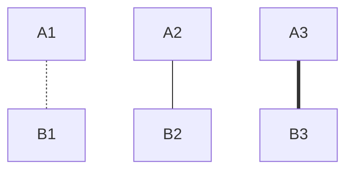

在基本线型符号串右边加上`>`符号，去掉左边第1个符号，使其仍然保持3个符号，就获得了带箭头的线型。

```
# 注明类型：mermaid
graph TB
A1 .-> B1
A2 --> B2
A3 ==> B3
```

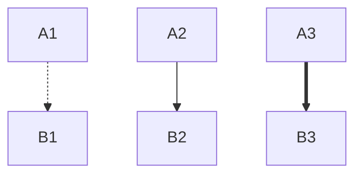

上面6种连线，中间都可以加上说明文字。带文字连线的符号串是这样子来的：
1. 在符号串的左边加上说明文字
1. 在说明文字的左边加上基本线型的符号串（只取前2个符号）

举个例子：
1. 虚线带箭头`.->`
1. 左边加上说明文字`remark .->`
1. 再在左边加上基本线型的前2个符号`.- remark .->`

```
# 注明类型：mermaid
graph TB
A1 -. 虚线文字 -.- B1
A2 -. 虚线文字 .-> B2

A3 -- 实线文字 --- B3
A4 -- 实线文字 --> B4

A5 == 粗线文字 === B5
A6 == 粗线文字 ==> B6
```

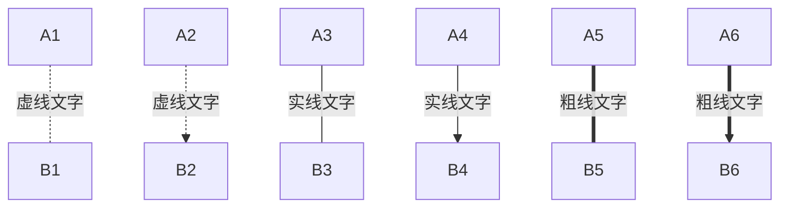

说明文字还有一种写法，更加简单清晰。

```
# 注明类型：mermaid
graph TB
A1 -.-|虚线文字| B1
A2 .->|虚线文字| B2

A3 ---|实线文字| B3
A4 -->|实线文字| B4

A5 ===|粗线文字| B5
A6 ===|粗线文字| B6
```

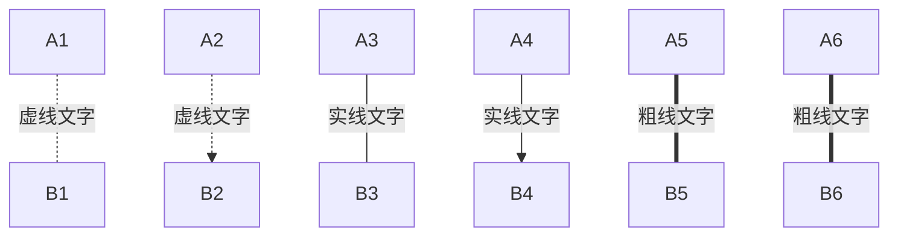

由3种基本线型，加上箭头变为6种，6种线型加上文字变成12种。

## 四种图形走向
所有节点之间的连线，带箭头的表示其具有方向性，一个`mermaid`代码块内，所有节点连线方向是一致的。总共有如下4种，用相应的两个字符表示：
- TB 从上到下（也可以用TD）
- BT 从下到上
- LR 从左到右
- RL 从右到左

其中`T`表示顶部，`B`表示底部，`L`表示左边，`R`表示右边。

```
# 注明类型：mermaid
graph TB
A1 -- TB --- B1
```

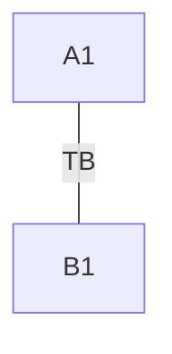

```
# 注明类型：mermaid
graph BT
A1 -- TB --- B1
```

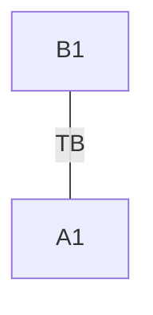

```
# 注明类型：mermaid
graph LR
A1 -- LR --- B1
```

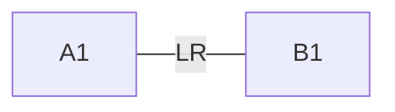

```
# 注明类型：mermaid
graph RL
A1 -- RL --- B1
```

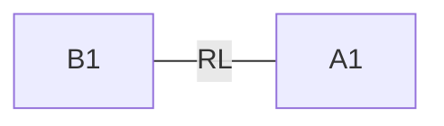

## 五种节点外观
`mermaid`只提供了5种节点的外观，一般可以满足要求。

|语法|形状|示例|
|:-:|:-:|:-:|
|[]|矩形|图1|
|()|矩形带小圆角|图2|
|(())|大圆|图3|
|{}|棱形|图4|
|>]|三角形矩形组合|图5|

为什么菱形不是`>`？因为这个符号要拿来表示箭头，分身乏术，只能用`{}`来表示。

```
# 注明类型：mermaid
graph BT
A1[A1]   --> B1
A2(A2)   --> B1
A3((A3)) --> B1
A4{A4}   --> B1
A5>A4]   --> B1
```

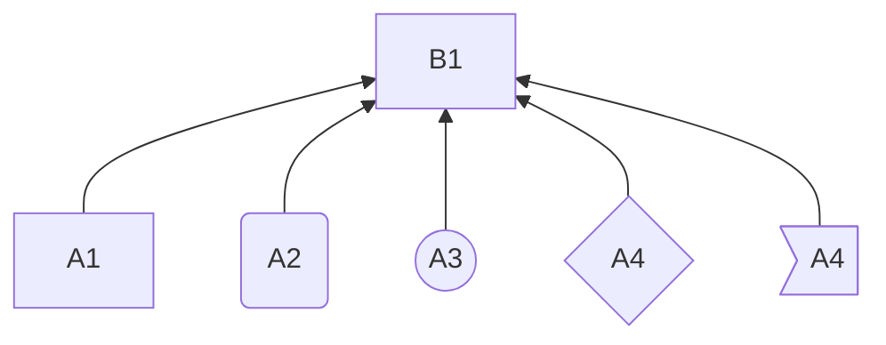

## 子图
`mermaid`还提供了子图形，可以被嵌入图形中。子图形以`subgraph`开始，以`end`结束。子图形必须提供标题，不能对图形方向做主。

```
# 注明类型：mermaid
graph BT
A1 --> B1
A2 --> B2
A3 --> B3

subgraph 子图1
A4 --> B3
end

subgraph 子图2
A5 --> B1
end
```

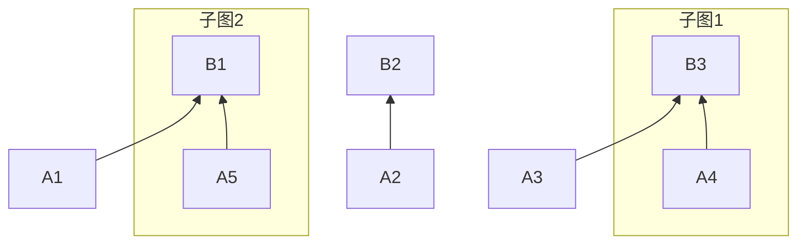

## 其它常见图形
时序图
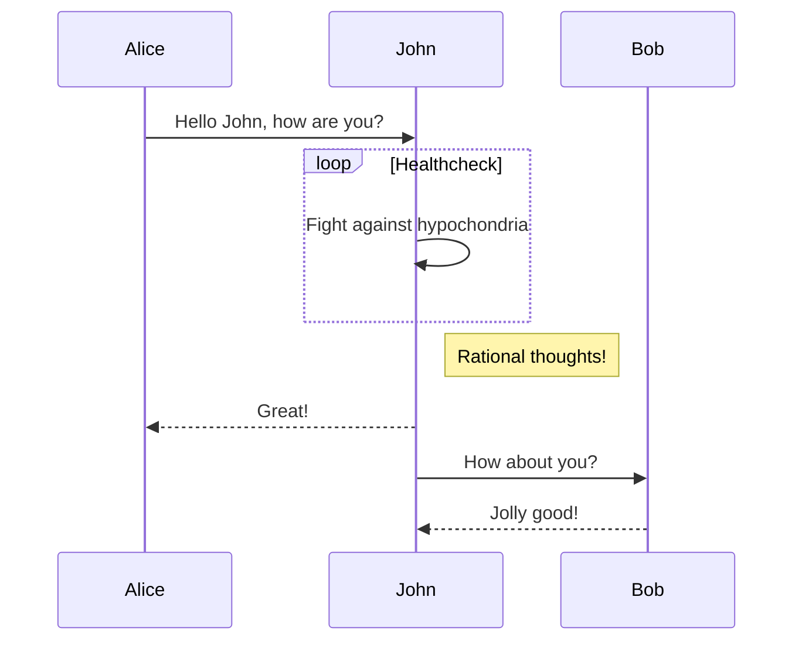

甘特图

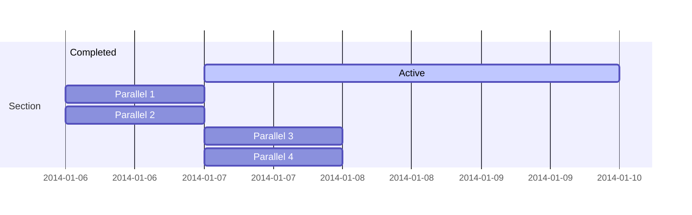


UML

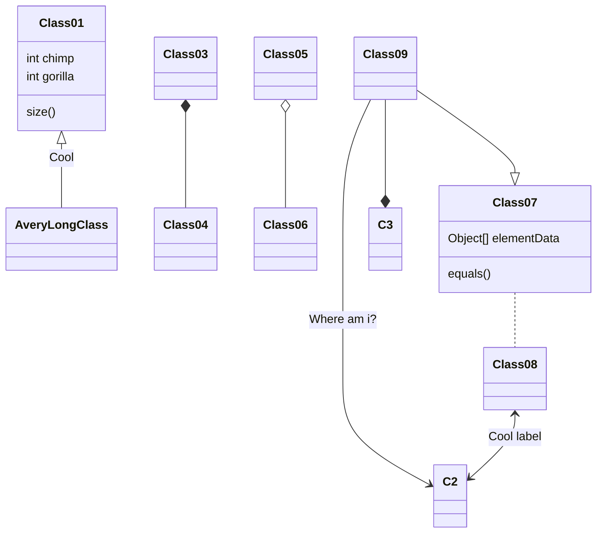

Git分支图


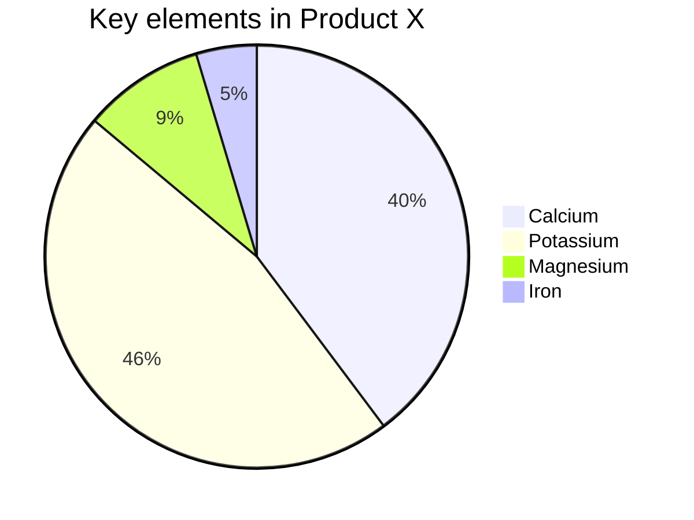

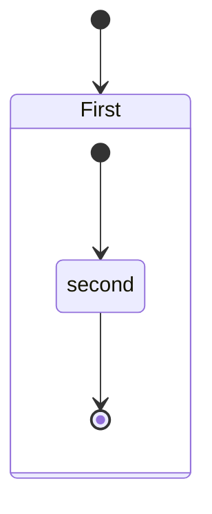