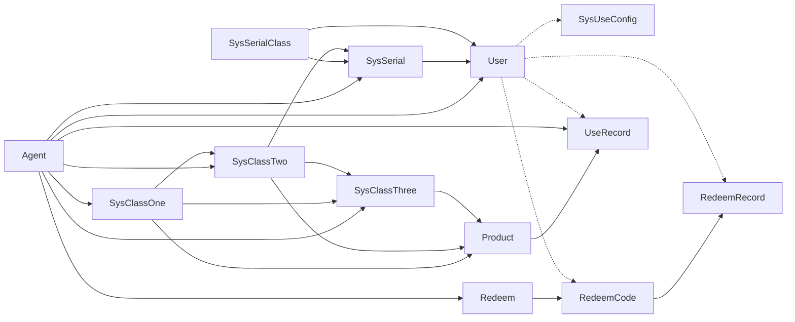

## 关键字

#### transient
1. 一旦变量被 `transient` 修饰，变量将不再是对象持久化的一部分，该变量内容在序列化后无法获得访问。
1. `transient` 关键字只能修饰变量，而不能修饰方法和类。注意，本地变量是不能被 `transient` 关键字修饰的。变量如果是用户自定义类变量，则该类需要实现 `Serializable` 接口。
1. 被 `transient` 关键字修饰的变量不再能被序列化，一个静态变量不管是否被 `transient` 修饰，均不能被序列化。

