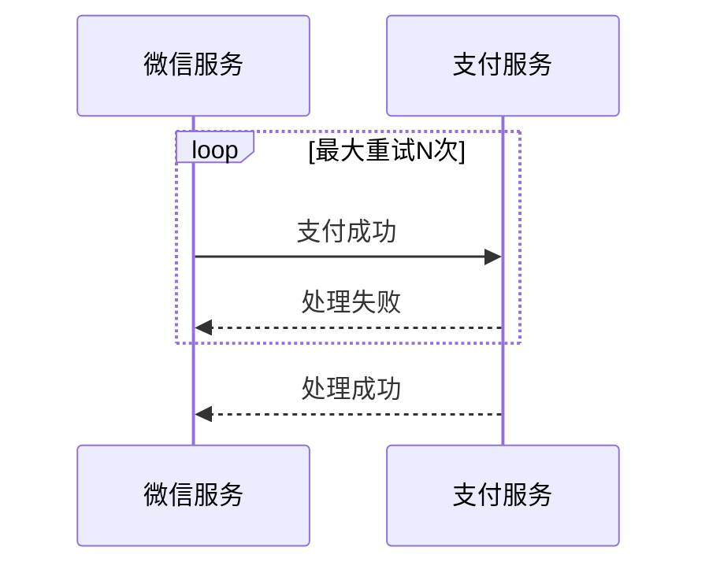
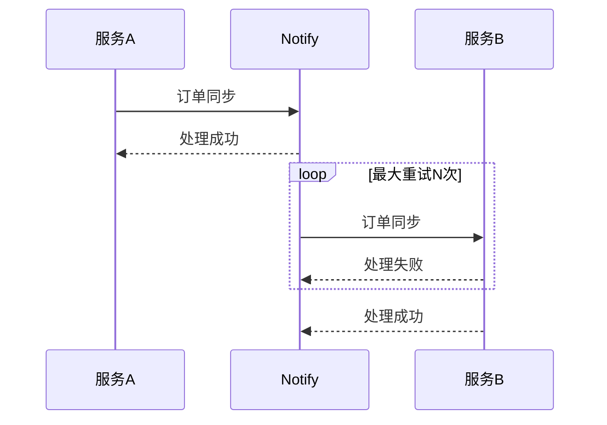

## XA
XA 又称两阶段提交，顾名思义就是要分两步提交。存在一个负责协调各个本地资源管理器的事务管理器，本地资源管理器一般是由数据库实现，事务管理器在第一阶段的时候询问各个资源管理器是否都就绪？如果收到每个资源的回复都是 yes，则在第二阶段提交事务，如果其中任意一个资源的回复是 no, 则回滚事务。

大致的流程：
1. 第一阶段（prepare）
   事务管理器向所有本地资源管理器发起请求，询问是否是 ready 状态，所有参与者都将本事务能否成功的信息反馈发给协调者；

1. 第二阶段 (commit/rollback)
   事务管理器根据所有本地资源管理器的反馈，通知所有本地资源管理器，步调一致地在所有分支上提交或者回滚。

存在的问题：
1. 同步阻塞
   当参与事务者存在占用公共资源的情况，其中一个占用了资源，其他事务参与者就只能阻塞等待资源释放，处于阻塞状态。

1. 单点故障
   一旦事务管理器出现故障，整个系统不可用。

1. 数据不一致
   在阶段二，如果事务管理器只发送了部分 commit 消息，此时网络发生异常，那么只有部分参与者接收到 commit 消息，也就是说只有部分参与者提交了事务，使得系统数据不一致。

1. 不确定性
   当协事务管理器发送 commit 之后，并且此时只有一个参与者收到了 commit，那么当该参与者与事务管理器同时宕机之后，重新选举的事务管理器无法确定该条消息是否提交成功。

## TCC
TCC 由 Try、Confirm、Cancel 三个阶段来进行：

1. Try 阶段
   尝试执行，完成所有业务检查（一致性）, 预留必须业务资源（准隔离性）。

   在 Try 阶段，是对业务系统进行检查及资源预览，比如订单和存储操作，需要检查库存剩余数量是否够用，并进行预留，预留操作的话就是新建一个可用库存数量字段，Try 阶段操作是对这个可用库存数量进行操作。

1. Confirm 阶段
   确认执行真正执行业务，不作任何业务检查，只使用 Try 阶段预留的业务资源，Confirm 操作满足幂等性。要求具备幂等设计，Confirm 失败后需要进行重试。

1. Cancel 阶段
   取消执行，释放 Try 阶段预留的业务资源 Cancel 操作满足幂等性 Cancel 阶段的异常和 Confirm 阶段异常处理方案基本上一致。

TCC 事务机制相比于 XA，解决了其几个缺点：

1. 单点故障
   解决了协调者单点，由主业务方发起并完成这个业务活动。业务活动管理器也变成多点，引入集群。

1. 同步阻塞
   引入超时，超时后进行补偿，并且不会锁定整个资源，将资源转换为业务逻辑形式，粒度变小。

1. 数据一致性
   有了补偿机制之后，由业务活动管理器控制一致性。

基于 TCC 实现分布式事务，会将原来只需要一个接口就可以实现的逻辑拆分为 Try、Confirm、Cancel 三个接口，所以代码实现复杂度相对较高。

## 本地消息表

## 最大努力通知
最大努力通知是最简单的一种柔性事务，适用于一些最终一致性时间敏感度低的业务，且被动方处理结果 不影响主动方的处理结果。

这个方案的大致意思就是：
1. 系统 A 本地事务执行完之后，发送个消息到 MQ；
1. 这里会有个专门消费 MQ 的服务，这个服务会消费 MQ 并调用系统 B 的接口；
1. 要是系统 B 执行成功就 ok 了；要是系统 B 执行失败了，那么最大努力通知服务就定时尝试重新调用系统 B, 反复 N 次，最后还是不行就放弃。

## 可靠消息最终一致性
123

## 使用场景
123

#### XA
目前支付宝使用两阶段提交思想实现了分布式事务服务 (Distributed Transaction Service, DTS) ，它是一个分布式事务框架，用来保障在大规模分布式环境下事务的最终一致性。

> 开源版本为 Seata。

#### TCC
TCC 需要事务接口提供 try, confirm, cancel 三个接口，提高了编程的复杂性。依赖于业务方来配合提供这样的接口，推行难度大，所以一般不推荐使用这种方式。

#### 可靠消息最终一致性
目前市面上支持该方案的 mq 只有阿里的 rocketmq, 该方案应用场景也比较多，比如用户注册成功后发送邮件、电商系统给用户发送优惠券等需要保证最终一致性的场景。

#### 本地消息表
跨行转账可通过该方案实现。

用户 A 向用户 B 发起转账，首先系统会扣掉用户 A 账户中的金额，将该转账消息写入消息表中，如果事务执行失败则转账失败，如果转账成功，系统中会有定时轮询消息表，往 mq 中写入转账消息，失败重试。mq 消息会被实时消费并往用户 B 中账户增加转账金额，执行失败会不断重试。

小米海外商城用户订单数据状态变更，会将变更状态记录消息表中，脚本将订单状态消息写入 mq，最终消费 mq 给用户发送邮件、短信、push 等。

#### 最大努力通知
最大努力通知最常见的场景就是支付回调，支付服务收到第三方服务支付成功通知后，先更新自己库中订单支付状态，然后同步通知订单服务支付成功。如果此次同步通知失败，会通过异步脚步不断重试地调用订单服务的接口。

小米海外商城目前除了支付回调外，最常用的场景是订单数据同步。例如系统 A、B 进行数据同步，当系统 A 发生订单数据变更，先将数据变更消息写入小米 notify 系统（作用等同 mq），然后 notify 系统异步处理该消息来调用系统 B 提供的接口并进行重试到最大次数。

