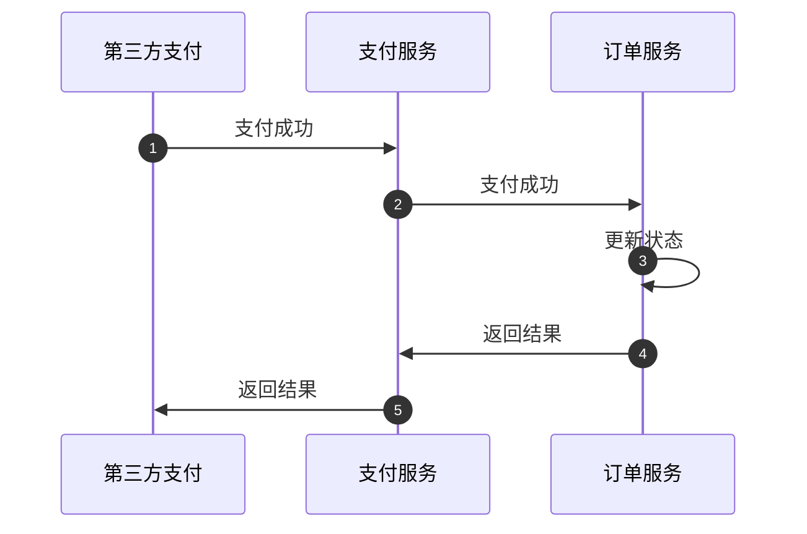
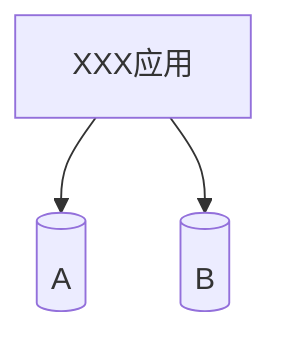
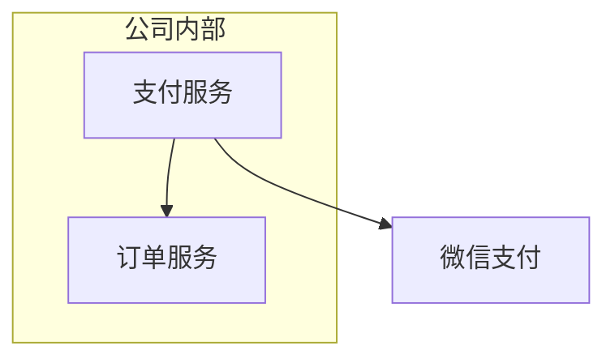

事务是指在一个操作单元中的所有操作最终要保持一致的行为，要么所有操作都成功，要么所有的操作都被撤销。

举个例子：你去小卖铺买东西，“一手交钱、一手交货”就是一个事务的例子，交钱和交货必须全部成功，事务才算成功，任一个操作失败，事务都将撤销所有已成功的活动。

事务可以看作是一次大的操作，它是由不同的小操作组成，这么操作要么全部成功，要么全部失败。例如：
1. 转账：包含转出和转入操作；
1. 网购：包含下单、扣减库存、支付等操作；

## 事务的四个特性
1. 原子性（要么全部执行、要么全部不执行）
   操作这些指令时，要么全部执行成功，要么全部不执行。只要其中一个指令执行失败，所有的指令都执行失败，数据进行回滚，回到执行前的数据状态；
1. 一致性（能量守恒、总量不变）
   食物的执行使数据从一个状态转换成为另一个状态，数据库的完整性没有被破坏；

   eg：拿转装来说，假设用户 A 和 B 两者的钱加起来一共是 2000，那么不管 A 和 B 之间如何转账，转几次帐，事务结束后两个用户的钱相加起来应该还是 2000，这就是事务一致性。
1. 隔离性（信息彼此独立，互不干扰）
   隔离性是当多个用户并发访问数据库时，比如操作同一张表，数据库为每一个用户开启的食物，不能被其它事务的操作所干扰，多个并发事务之间要相互隔离。

1. 持久性（不会轻易改变）
   当事务正确完成后，它对于数据的改变是永久性的。

## 本地实现事务
```sql
begin transaction;
-- 1. 本地数据库操作：张三减少金额
-- 2. 本地数据库操作：李四增加金额
commit transaction;
```

## 分布式事务
随着互联网的快速发展，软件系统由原来的单体应用转变为分布式应用。分布式应用会把一个应用系统拆分成可独立部署的多个服务，因此需要服务与服务之间远程协作才能完成事务操作。这种分布式系统环境下由不同的服务之间通过网络远程协作完成的事务称之为分布式事务，例如用户注册送积分事务、创建订单减库存事务，银行转账事务等都是分布式事务。

## CAP 原则
CAP 原则又叫 CAP 定理，同时又被称作布鲁尔定理（Brewer's theorem），指的是在一个分布式系统中，不可能同时满足以下三点：
1. Consistency 一致性（副本最新）
   指在写操作完成后开始的任何读操作都必须返回该值，或者后续写操作的结果。

   也就是说，在一致性系统中，一旦客户端将值写入任何一台服务器并获取响应，那么之后客户端从其他任何服务器读取的都是刚写入的数据。

   一致性保证了不管向哪台服务器写入数据，其他的服务器能实时同步数据。

1. Availability 可用性（高可用）
   可用性是指，每次向未崩溃的节点发送请求，总能保证收到响应数据（允许不是最新数据）。

1. Partition tolerance 分区容忍性（能容忍网络分区）
   分布式系统在遇到任何网络分区故障的时候，仍然能够对外提供满意一致性的可用性的服务。也就是说，服务器 A 和 B 发送给对方的任何消息都是可以放弃的，也就是说 A 和 B 可能因为各种意外情况，导致无法成功进行同步。分布式系统要能容忍这种情况。除非整个网络环境都发生了故障。

> 什么是分区：在分布式系统中，不同的节点分布在不同的子网络下，由于一些特殊的原因，这些子节点之间出现了网络不通的状态，但它们的内部子网络是正常的。从而导致了整个系统的环境被切分成了若干个孤立的区域。这就是分区。

## 一致性
一致性可以分为强一致性和弱一致性。所谓强一致性，即复制是同步的，弱一致性，复制是异步的。

CAP 理论中，我们只能在 C、A、P 中选择两个条件。而对于业务系统而言，我们往往选择牺牲一致性来换取系统的可用性和分区容错性。不过这里要指出的是，所谓的“牺牲一致性”不是完全放弃数据一致性，而是牺牲强一致性换取弱一致性。

#### 强一致性
系统中的某个数据被成功更新后，后续任何对该数据的读取操作都将得到更新后的值。也称为：原子一致性（Atomic Consistency）、线性一致性（Linearizable Consistency）。

两个要求：
1. 任何一次读都能读到某个数据的最近一次写的数据；
1. 系统中的所有进程，看到的操作顺序，都和全局时钟下的顺序一致。

简而言之，在任意时刻，所有节点中的数据是一样的。例如，对于关系型数据库，要求更新过的数据能被后续的访问都能看到。

总结：
1. 一个集群需要对外部提供强一致性，所以只要集群内部某一台服务器的数据发生了变化，那么就需要等待集群内其他服务器的数据同步完成之后，才能保证对外提供服务；
1. 保证了强一致性，务必会造成损耗可用性；

#### 弱一致性
系统中的某个数据被更新后，后续对该数据的读取操作可能得到更改后的值，也可能是更改前的值。

但即使过了“不一致时间窗口”这段时间后，后续对该数据的读取也不一定是最新的。

所以说，可以理解为数据更新后，如果能容忍后续的访问只能访问到部分或者全部访问不到，则是若一致性。

#### 最终一致性
是若一致性的特殊形式，存储系统保证在没有新的更新的条件下，最终所有的访问都是最新更新的值。

不能保证任意时刻任意节点上的同一份数据都是相同的，但是随着时间的迁移，不同节点上的同一份数据总是向着趋同的方向变化。

## BASE 理论
BASE 理论即 Basic Available（基本可用）、Soft State（柔性状态）、Eventual Consisstency（最终一致性）：

1. 基本可用
   整个系统在某些不可抗力的情况下，仍然能够保证“可用性”，即一定时间内仍然能够返回一个明确的结果。

   例如：当举行大促时，响应时间可以适当延长，或者给部分用户返回一个降级页面，从而缓解服务器压力。

1. 柔性状态
   即允许系统中的数据存在中间状态，并认为该状态的存在不会影响系统的整体可用性，允许系统不同节点的数据副本之间进行数据同步的过程存在延迟。

   例如：微信支付，等待回调，中间有几秒延迟，使用“支付中”状态表示。

1. 最终一致性
   同一数据的不同副本的状态，可以不需要实时一致，但一定要保证经过一定时间后仍然是一致的。

BASE 理论是对 CAP 中的一致性和可用性进行一个权衡的结果，理论的核心思想是：我们无法做到强一致性，但每个应用都可以根据自身的业务特点，采用适当的方式来使系统达到最终一致性。


## 应用场景
分析具体应用场景，包括以下三个：A、服务内跨数据库的事务；B、跨内部服务的事务；C、跨外部服务的事务。

其中划分内部和外部的标准是：内部服务我们可以控制其实现，修改配置或代码；外部服务指的是第三方的，只能约定通信的方式和具体协议，具体代码实现在控制范围之外。

#### 转账
转账是最经典的分布式事务场景，假设用户 A 使用银行 app 发起一笔跨行转账给用户 B，银行系统首先扣掉用户 A 的钱，然后增加用户 B 账户中的余额。此时就会出现 2 种异常情况：
1. 用户 A 的账户扣款成功，用户 B 账户余额增加失败；
1. 用户 A 的账户扣款失败，用户 B 账户余额增加成功；

对于银行系统来说，以上 2 种情况都是不允许发生，此时就需要分布式事务来保证转账操作的成功。

#### 扣库存
在电商系统中，下单是用户最常见操作。在下单接口中必定会涉及生成订单 id, 扣减库存等操作，对于微服务架构系统，订单 id 与库存服务一般都是独立的服务，此时就需要分布式事务来保证整个下单接口的成功。

#### 同步超时
在微服务体系架构下，我们的支付与订单都是作为单独的系统存在。订单的支付状态依赖支付系统的通知，假设一个场景：我们的支付系统收到来自第三方支付的通知，告知某个订单支付成功，接收通知接口需要同步调用订单服务变更订单状态接口，更新订单状态为成功。

流程图如下，从图中可以看出有两次调用，第三方支付调用支付服务，以及支付服务调用订单服务，这两步调用都可能出现调用超时的情况，此处如果没有分布式事务的保证，就会出现用户订单实际支付情况与最终用户看到的订单支付情况不一致的情况。



## 分布式事务的场景类型
分布式事务的应用类型包括以下三个：A、服务内跨数据库的事务；B、跨内部服务的事务；C、跨外部服务的事务。

其中划分内部和外部的标准是：内部服务我们可以控制其实现，修改配置或代码；外部服务指的是第三方的，只能约定通信的方式和具体协议，具体代码实现在控制范围之外。

#### 服务内跨数据库
在同一个服务方法内，访问两个或两个以上数据库。

我们知道，Java 事务是通过 `Connection` 对象控制的。不同的数据库，是不同的数据库链接，通过不同的 `Connection` 对象实现。传统数据库事务无法实现事务控制，需要引入事务协调者的概念。这个场景中分布式体现在数据库的部署上。



#### 跨内部服务的事务
一个服务通过微服务框架或者 RPC 调用调用其他的服务，多个子服务需要同时成功或失败。每个子服务都有自己的持久化方式，不一定是数据库，体现事务的持久性。每个子服务部署在不同的服务容器中，不同的服务容器部署在不同的服务器节点上。这个场景中分布式体现在服务（或应用）的部署上。

这时候，事务的概念已经超出“数据库”的范畴了。


#### 跨外部服务的事务
这个场景是在跨内部服务的事务的基础上更进一步，服务的具体实现在我们控制范围之外。我们不能限制其实现语言，不能要求指定方法上加标注（注解）。甚至除了服务调用的网络通道外，我们不能期望服务间访问相同的 Zookeeper 作为事务协调器。在这个场景中，我们只能在通信协议层面做约定，是最彻底的分布式场景。



## 参考文章
[分布式事务，这一篇就够了](https://xiaomi-info.github.io/2020/01/02/distributed-transaction/)
[阿里分布式事务框架Seata原理解析](https://www.jianshu.com/p/044e95223a17)
[使用Seata彻底解决Spring Cloud中的分布式事务问题！](https://cloud.tencent.com/developer/article/1543101)