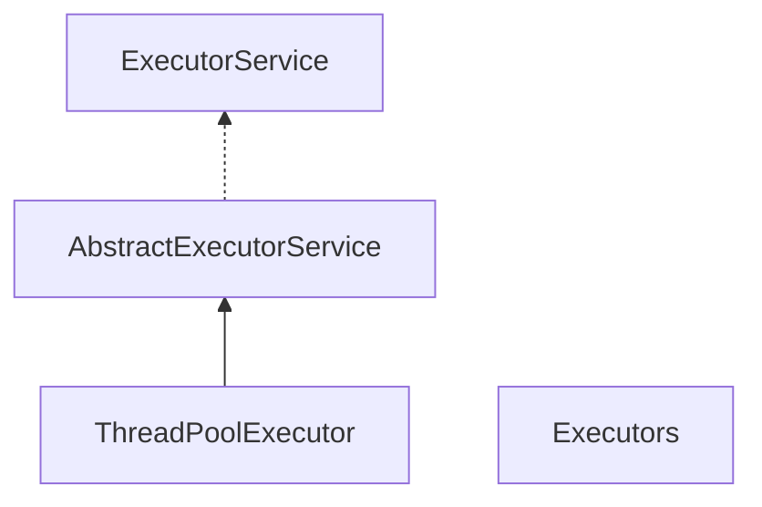
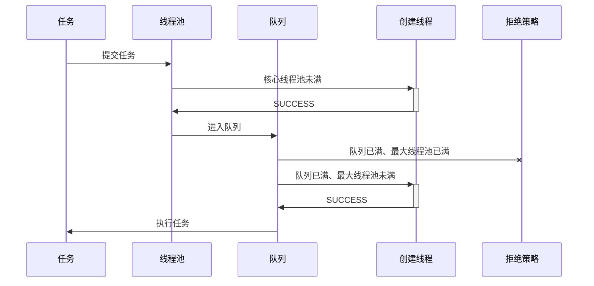

在讨论线程池之前，我们先理解几个概念：
1. `ExecutorService`
1. `ThreadPoolExecutor`
    `ThreadPoolExecutor`是线程池的真正实现，他通过构造方法的一系列参数，来构成不同配置的线程池。
1. Executors

| 参数 | 类型 | 含义 |
| :- | :- | :- |
| corePoolSize | int | 	核心线程池大小 |
| maximumPoolSize | int | 最大线程池大小 |
| keepAliveTime | long | 线程最大空闲时间 |
| unit | TimeUnit | 时间单位 |
| workQueue | BlockingQueue<Runnable> | 线程等待队列 |
| threadFactory | ThreadFactory | 线程创建工厂 |
| handler | RejectedExecutionHandler | 拒绝策略 |

## ExecutorService
`ExecutorService`使用线程池中的线程执行每个提交的任务，所有的线程池都实现了这个接口。通常我们使用`Executors`的工厂方法来创建`ExecutorServer`。

`ExecutorService`解决了两个不同的问题：
1. 提升性能：它们通常在执行大量异步任务时，由于减少了每个任务的调用开销，并且它们提供了一种限制和管理资源（包括线程）的方法，使得性能提升明显
1. 统计信息：每个`ThreadPoolExecutor`保持一些基本的统计信息，例如完成的任务数量

## corePoolSize、maximumPoolSize
线程池执行器将会根据`corePoolSize`、`maximumPoolSize`自动地调整线程池大小。

当在`execute(Runable)`方法中提交新任务并且少于`corePoolSize`线程正在运行时，即使其它工作线程处于空闲状态，也会创建一个新线程来处理该请求。如果有多于`corePoolSize`但小于`maximumPoolSize`的线程正在运行，则仅当队列已满时才会创建新线程。

通过设置相同的corePoolSize和maxinumPoolSize，我们可以创建一个固定大小的线程池。通过将maxinumPoolSize设置为基本上无界的只，例如Integer.MAXX_VALUE，我们可以允许线程池容纳任意数量的并发任务（可能会抛出`OutOfMemoryError`）。

通常，`corePoolSize`和`maximumPoolSize`仅在构建时设置，但也可以使用`setCorePoolSize`和`setMaxinumPoolSize`进行动态的更改。

## prestartCoreThread
在默认情况下，只有当新任务到达时，才开始创建和启动核心线程，但是我们可以使用下面2个方法进行动态调整（如果使用非空队列构建池，则可能需要预先启动线程）。

| 方法 | 作用 |
| :-- | :-- |
| prestartCoreThread() | 创一个空闲任务线程等待任务的到达 |
| prestartAllCoreThreads() | 创建核心线程池数量的空闲任务线程等待任务的到达 |

## ThreadFactory
新线程使用`ThreadFactory`创建，如果未另行指定，则使用`Executors.defaultThreadFactory`默认工厂，使其全部位于同一个ThreadGroup中，并且具有相同的优先级和非守护进程状态。

通过提供不同的`ThreadFactory`，您可以更改线程的名称，线程组，优先级，守护进程状态等。

## keepAliveTime
如果线程池拥有超过核心线程池数的线程，那么多余的线程在空闲时间超过`keepAliveTime`时会被终止。

## BlockingQueue
`BlockingQueue`队列用于存放提交的任务，它的实际容量与线程池大小无关。
1. 如果当前线程池任务线程数小于核心线程数，执行器总是优先创建一个任务线程，而不是从线程队列中取一个空闲线程
1. 如果当前线程池任务线程数大于核心线程数，执行器总是优先先线程队列中去一个空闲线程，而不是创建一个任务线程
1. 如果当前线程池任务线程数大于核心线程数，且队列中无空闲任务线程，将会创建一个任务线程，直到超出最大线程数，从而拒绝任务

队列主要有3种策略：
1. Direct handoffs：直接握手队列，一个很好的默认选项是`SynchronousQueue`，它将任务交给线程而不需要保留。这里，如果没有线程立即可用来运行它，那么排队任务的尝试将失败，因此将构建新的线程
1. Unbounded queues：无界队列，当所有核心线程繁忙时，使用无界队列（例如，没有预定指定容量的`LinkedBlockQueue`）将导致新任务在队列中等待，从而导致`maximumPoolSize`值没有任何作用。当每个任务互不影响，完全独立于其它任务时，这可能是合适的：例如，在网页服务器中，这种队列方式可以用于平滑瞬时大量请求。
1. Bounded queues：一个有界的队列（例如`ArrayBlockingQueue`）和有限的`maximumPoolSize`有助于防止资源耗尽。

使用大队列和较小的`maximumPoolSizes`可以最大限度地减少CPU使用率，操作系统资源和上下文切换开销，但会导致人为的低吞吐量。如果任务经常被阻塞（比如I/O限制），那么系统可以调度比我们允许的更多的线程。

使用小队列通常需要较大的`maximumPoolSizes`，这会使CPU更加繁忙，遇到不可接受的调度开销，这也会降低吞吐量。

## Rejected Tasks
拒绝任务有2种情况：线程池已经被关闭、任务队列已满且`maximumPoolSizes`已满。

无论是哪种情况，都会调用`RejectedExecutionHandler`的`rejectedExecution`方法，它预定义了4种处理策略：
1. AbortPoliy：默认策略，抛出`RejectedExecutionException`运行时异常
1. CallerRunsPolicy：提供了一个简单的反馈控制机制，可以减慢提交新任务的速度
1. DiscardPolicy：直接丢弃新提交的任务
1. DiscardOldestPolicy：如果执行器没有关闭，队列头的任务将会被抛弃，然后重新尝试执行任务

## Hook Methods
`ThreadPoolExecutor`为每个任务执行前后提供了钩子方法`beforeExecute`和`afterExecute`用于操纵执行环境：例如，重新初始化ThreadLocals，收集统计信息或记录日志等。此外，`terminated`方法在线程池完全终止之后会被触发，可以重写此方法以执行特殊业务。

需要留意是的，如果钩子方法或回调方法抛出异常，内部的任务线程将会失败并结束。

## Finalization
如果程序中不再持有线程池的引用，并且线程池中没有线程时，线程池将会自动关闭。如果你希望确保即使用户忘记调用`shudown()`也可以回收未引用的线程池，那么必须通过设置适当的`keepAliveTime`并设置`allowCoreThreadTimeOut(true)`或者使得`corePoolSize`的值为0。

一般情况下，线程池启动后建议手动调用`shutdown()`关闭。

## 预设线程池
在常见场景中，Java预设了几种线程池，可以通过`Executors`的工厂方法创建使用：
- Executors.newFixedTrheadPool：固定大小的线程池
- Executors.newCachedThreadPool：无界线程池，自动回收
- Executors.newSingleThreadExecutor：单一后台线程 

