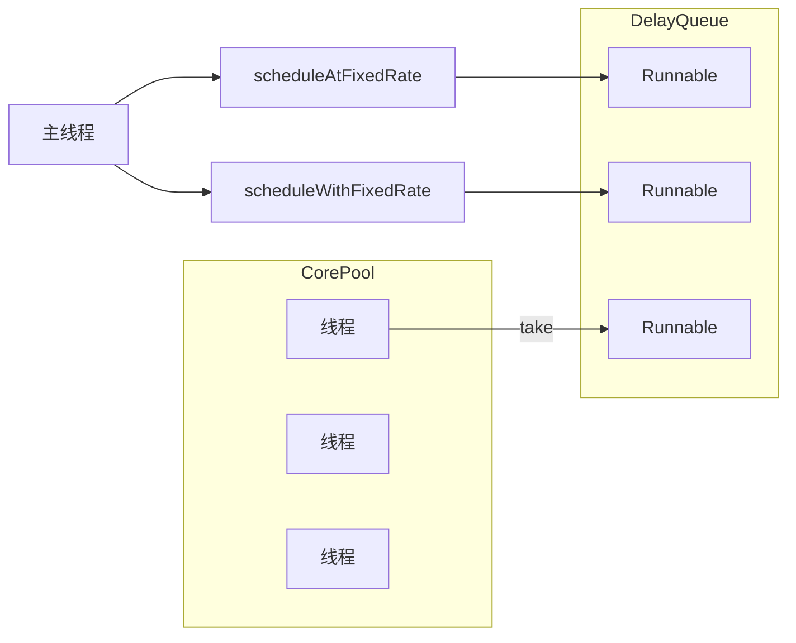

ScheduledThreadPool用来处理延时任务或定时任务，它接受SchduledFutureTask类型的任务，有两种提交任务的方式。




## scheduleAtFixedRate
每间隔一段时间执行，分为两种情况：
1. 当前任务执行时间小于间隔时间，每次到点即执行
1. 当前任务执行时间大于等于间隔时间，任务执行后立即执行下一次任务。相当于连续执行了

```java
/**
 * 任务执行时间（10s）小于间隔时间(10s)
 */
public class ScheduleExecutorPool {

    public static void main(String[] args) {
        ScheduledExecutorService scheduler = Executors.newScheduledThreadPool(1);
        
        System.out.println("start...");
        scheduler.scheduleAtFixedRate(() -> {
            System.out.println("Start: scheduleAtFixedRate:    " + new Date());
            try {
                TimeUnit.SECONDS.sleep(2);
            } catch (InterruptedException e) {
                e.printStackTrace();
            }
            System.out.println("End  : scheduleAtFixedRate:    " + new Date());
        }, 0, 10, TimeUnit.SECONDS);
    }
}
// Start: scheduleAtFixedRate:    Mon Feb 03 18:57:43 CST 2020
// End  : scheduleAtFixedRate:    Mon Feb 03 18:57:45 CST 2020
// Start: scheduleAtFixedRate:    Mon Feb 03 18:57:53 CST 2020
// End  : scheduleAtFixedRate:    Mon Feb 03 18:57:55 CST 2020
// Start: scheduleAtFixedRate:    Mon Feb 03 18:58:03 CST 2020
// End  : scheduleAtFixedRate:    Mon Feb 03 18:58:05 CST 2020

/**
 * 任务执行时间（15s）大于间隔时间(10s)
 */
public class ScheduleExecutorPool {

    public static void main(String[] args) {
        ScheduledExecutorService scheduler = Executors.newScheduledThreadPool(1);

        scheduler.scheduleAtFixedRate(() -> {
            System.out.println("Start: scheduleAtFixedRate:    " + new Date());
            try {
                TimeUnit.SECONDS.sleep(15);
            } catch (InterruptedException e) {
                e.printStackTrace();
            }
            System.out.println("End  : scheduleAtFixedRate:    " + new Date());
        }, 0, 10, TimeUnit.SECONDS);
    }
}

// Start: scheduleAtFixedRate:    Mon Feb 03 19:00:39 CST 2020
// End  : scheduleAtFixedRate:    Mon Feb 03 19:00:54 CST 2020
// Start: scheduleAtFixedRate:    Mon Feb 03 19:00:54 CST 2020
// End  : scheduleAtFixedRate:    Mon Feb 03 19:01:09 CST 2020
// Start: scheduleAtFixedRate:    Mon Feb 03 19:01:09 CST 2020
```

## scheduleWithFixedDelay
每当上次任务执行完毕后，间隔一段时间执行。不管当前任务执行时间大于、等于还是小于间隔时间，执行效果都是一样的。

```java
/**
 * 任务执行时间（5s）小于间隔时间(10s)
 * 可以看出每个End后，等待了10秒，才启动下一次Start。
 */
public class ScheduleExecutorPool {

    public static void main(String[] args) {
        ScheduledExecutorService scheduler = Executors.newScheduledThreadPool(1);

        scheduler.scheduleWithFixedDelay(() -> {
            System.out.println("Start: scheduleAtFixedRate:    " + new Date());
            try {
                TimeUnit.SECONDS.sleep(5);
            } catch (InterruptedException e) {
                e.printStackTrace();
            }
            System.out.println("End  : scheduleAtFixedRate:    " + new Date());
        }, 0, 10, TimeUnit.SECONDS);
    }
}
// Start: scheduleAtFixedRate:    Mon Feb 03 19:03:41 CST 2020
// End  : scheduleAtFixedRate:    Mon Feb 03 19:03:46 CST 2020
// Start: scheduleAtFixedRate:    Mon Feb 03 19:03:56 CST 2020
// End  : scheduleAtFixedRate:    Mon Feb 03 19:04:01 CST 2020
// Start: scheduleAtFixedRate:    Mon Feb 03 19:04:11 CST 2020


/**
 * 任务执行时间（15s）大于间隔时间(10s)
 * 可以看出每个End后，等待了10秒，才启动下一次Start。
 */
public class ScheduleExecutorPool {

    public static void main(String[] args) {
        ScheduledExecutorService scheduler = Executors.newScheduledThreadPool(1);

        scheduler.scheduleWithFixedDelay(() -> {
            System.out.println("Start: scheduleAtFixedRate:    " + new Date());
            try {
                TimeUnit.SECONDS.sleep(15);
            } catch (InterruptedException e) {
                e.printStackTrace();
            }
            System.out.println("End  : scheduleAtFixedRate:    " + new Date());
        }, 0, 10, TimeUnit.SECONDS);
    }
}
// Start: scheduleAtFixedRate:    Mon Feb 03 19:06:41 CST 2020
// End  : scheduleAtFixedRate:    Mon Feb 03 19:06:57 CST 2020
// Start: scheduleAtFixedRate:    Mon Feb 03 19:07:07 CST 2020
// End  : scheduleAtFixedRate:    Mon Feb 03 19:07:22 CST 2020
```