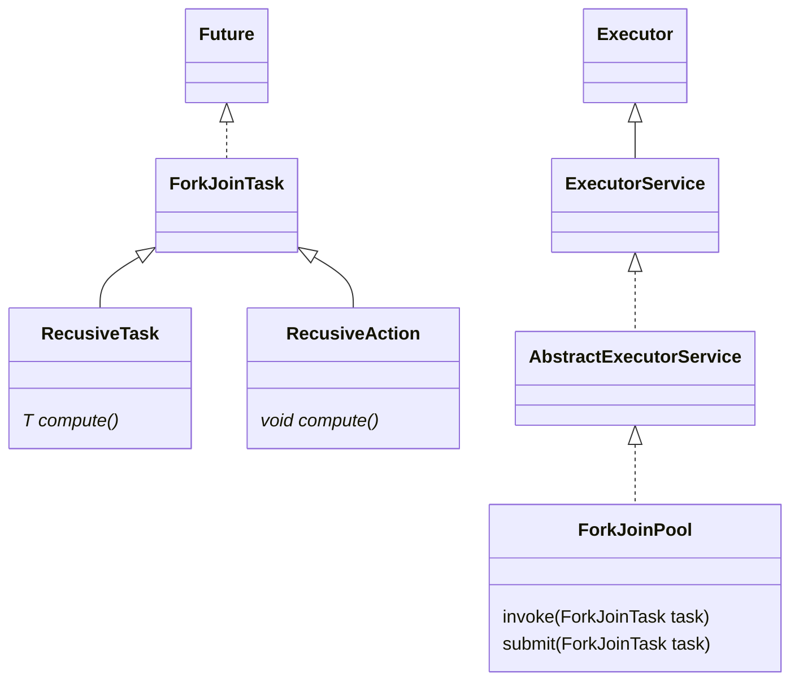

Java7提供了ForkJoinPool来支持将一个任务拆分成多个“小任务”并行计算，再把多个“小任务”的结果合并成总的计算结果。

ForkJoinPool是ExecutorService的实现类，因此是一种特殊的线程池。

## 使用方法
创建ForkJoinPool实例之后，就可以调用它的`submit(ForkJoinTask<T> task)`或`invoke(ForkJoinTask<T> task)`来执行任务了。

其中ForkJoinTask代表一个可以并行、合并的任务。ForkJoinTask是可以抽象类，它还有两个抽象子类：RecusiveAction和RecusiveTask。其中RecusiveTask代表有返回值的任务，而RecusiveAction代表没有返回值的任务。

## 实例
