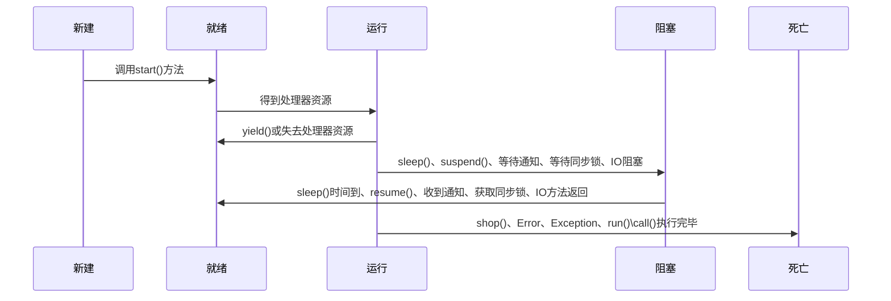

#### 什么是进程，什么是线程
1. 进程是一个独立的运行环境，它可以是一个程序或应用。
1. 线程可以看作是一个轻量级进程，是进程中的一个执行任务。它仅需要较少的资源来创建和驻留在进程中，并且可以共享进程中的资源
1. Java运行环境（单一man()方法）是一个包含了不同的类和程序的单一进程

## 概念性问题
#### 什么是用户线程，什么是守护线程
1. 在Java中有2类线程：用户线程（User Thread）和守护线程（Daemon Thread）
1. 守护线程是JVM中专门用于服务其它的线程，比如垃圾回收线程
1. 用户线程就是用户在Java程序中创建的线程

#### 守护线程的特点
1. 守护线程中产生的新线程也是守护线程
1. 守护线程随着JVM的退出而退出（当所有的用户线程都运行完毕时，JVM就自动退出）

#### 为什么要用守护线程
1. 从守护线程的定位（服务于其它线程）看，垃圾回收器就适合使用守护线程
1. 我们希望定义些定时轮询的任务，这些任务只在程序运行间起作用，程序退出后自动退出。这种情况可以使用守护线程。因为如果用用户线程来运行这些任务，那么程序就一直结束不了（JVM只有在所有用户线程结束时才结束）
1. Web应用的定时任务不需要守护线程，因为一般而言，Web应用是不需要关闭的

#### 哪些地方不能用守护线程
1. 读写操作或者计算逻辑等地方不能使用守护线程。因为守护线程会随着JVM的退出而退出，而不管它自己是否运行完毕

#### 如何创建守护线程
1. 使用Thread类的setDaemon(true)方法可以将线程设置为守护线程，需要注意的是，需要在调用start()方法前调用这个方法，否则会抛出IllegalThreadStateException异常

```java
Thread daemonTread = new Thread();
 
  // 设定 daemonThread 为 守护线程，default false(非守护线程)
daemonThread.setDaemon(true);
 
 // 验证当前线程是否为守护线程，返回 true 则为守护线程
daemonThread.isDaemon();
```

#### 什么是线程调度器和时间分片
1. 线程调度器是一个操作系统服务，它负责为Runnable状态的线程分配CPU时间。一旦我们创建一个线程并启动它，它的执行便依赖于线程调度器的实现
1. 时间分片是只将可用的CPU时间分配给可用的Runnable线程的过程。

#### 线程直接是如何通信的
1. 线程之间通过Object类的wait()、notify()、notifyAll()等方法进行通信

#### 为什么线程之间通信的方法wait()、notify()、notifyAll()被定义在Object类里
1. 线程中并没有可供任何对象使用的锁和同步器
1. 每个对象中都有一个锁，wait()、notify()、notifyAll()等方法用于等待对象的锁或通知其它线程此对象可用

#### 为什么wait()、notify()、notifyAll()等方法必须在同步方法或同步块中使用
1. 线程在调用对象的wait()方法之间，必须拥有此对象的锁
1. 线程在调用对象的wait()方法之后，就会释放此对象的锁方便其它线程时间并进入等待状态
1. 其它线程获得了此对象的锁之后，执行完了自己的业务逻辑后，便可以调用notify/notifyAll()方法，通知所有在wait的线程，同时释放该对象的锁
1. 由于所有的这些方法都需要线程持有对象的锁，所以只能够通过同步（同步方法或同步块）来实现。

#### 什么是同步方法，什么是同步块
1. 同步方法即synchronized关键字修饰的方法，由于Java每个对象都有一个内置锁，内置锁会保护整个方法。在调用该方法前，需要获取内置锁，否则就处于阻塞状态
1. 同步块即sychronized关键字修饰的语句块，被该关键字修饰的语句块会自动被加上内置锁，从而实现同步
1. sychronized也可以修饰静态方法，此时如果调用该静态方法，将会锁住整个类

#### 为什么Thread类的sleep()和yield()方法是静态的
1. sleep()和yield()方法是在当前的线程上运行的，所有其它处于等待状态的线程上调用这些方法是没有意义的
1. 将它们设置为静态的，可以避免程序员错误的认为可以在其它非运行线程调用这些方法

```java
// 错误用法，将t1线程睡眠1000ms
Thread t1 = new Thread();
t1.sleep(1000);

// 正确用法，将当前线程睡眠1000ms
Thread.sleep(1000);
```

#### 什么是ThreadLocal
1. ThreadLocal用于创建线程的本地变量，每个线程都会拥有他们自己的ThreadLocal变量
1. 我们知道一个对象的所有线程会共享它的全局变量，所以这些变量是不安全的，我们可以使用同步技术，或者ThreadLocal变量

#### 什么是ThreadGroup

#### 什么是死锁
1. 死锁是指两个以上的线程永远阻塞的情况

#### 如何分析和避免死锁

#### 什么是Java Timer类，如果用它创建一个有特定时间间隔的线程

#### 什么是线程的生命周期
1. 新建状态
    当程序使用new关键字创建一个线程之后，改线程就处于新建状态，此时仅有JVM为其分配内存，并初始化其成员变量
1. 就绪状态
    当线程对象调用了start()方法之后，该线程处理就绪状态JVM会为其创建方法调用栈和程序计数器，等待调度运行
1. 运行状态
    如果处于就绪状态的线程获取了CPU，开始执行run()方法的线程执行体，则该线程处于运行状态
1. 阻塞状态
    当处于运行状态的线程失去所占用资源之后，便处于阻塞状态
1. 死亡状态
    线程会以一以下3种方式结束，结束后就处于死亡状态：
    1. run()或call()方法执行完毕，线程正常结束
    1. 线程抛出一个未捕捉的Error或Exception
    1. 直接调用该线程的stop()方法来，该方法容易导致死锁，不建议使用



#### 什么是线程优先级
1. 每个线程都有它的优先级，优先级越高的线程在运行时会具有优先权，但这依赖于线程调度的实现，这个实现是和操作系统相关的
1. 优先级是一个int变量（1-10），1代表最低，10代表最高。我们可以定义线程的优先级，但是不能保证最高优先级的线程先执行

#### 在多线程中，什么是上下文切换
1. 上下文切换是存储和恢复CPU状态的过程，它使得线程执行能够从中断点恢复执行
1. 上下文切换是多任务操作系统的多线程环境的基本特征

#### 什么是线程安全

#### 什么是volatile关键字
1. 一般情况下，所有的线程去读取一个变量时，会缓存这个变量的拷贝，以避免锁的问题，提高性能。但是同时如果有多个线程去修改这个变量（拷贝），则它们之间会产生冲突（一个线程将其设置为10，另一个线程将其设置为20）
1. 如果用volatile修饰此变量，则所有线程之间读取此变量并且不缓存它，这就确保了线程读取到的变量在内存中是一致的

#### 什么是线程池，如何创建一个线程池
1. 一个线程池管理了一组工作线程，同时它还包括了一个用于存放等待执行的任务队列

## 操作问题
#### 如何创建一个线程

#### 如何确保线程安全
1. 使用同步锁
1. 使用原子类实现并发锁
1. 使用volatile关键字
1. 使用不变类和线程安全类

## 如何创建一个线程池
1. 自定义创建
1. Executors创建

#### 可以直接调用Thread类的run()方法吗
1. 可以，但是如果我们直接调用了run()方法，则它的行为和普通的方法调用一样，不会在新的线程执行
1. 为了在新的线程中执行我们的代码，必须用Thread.start()方法

#### 如何让正在运行的线程暂停一段时间
1. 调用线程的sleep()方法可以让线程暂停一段时间

#### 如何确保main()方法所在的线程是Java程序最后结束的线程
1. 使用Thread类的join()方法来确保所有程序创建的线程在main()方法退出前结束

```java
public static void main(String[] args) {
    Thread t1 = new Thread(new MyRunnable(), "t1");
    Thread t2 = new Thread(new MyRunnable(), "t2");
    Thread t3 = new Thread(new MyRunnable(), "t3");
    
    t1.start();
    t2.start();
    t3.start();
    
   
    t1.join();
    t2.join();
    t3.join();
    
    System.out.println("All threads are dead, exiting main thread");
}

```

## 对比问题

#### 多线程编程的好处是什么
1. IO密集型任务，多个线程并发执行任务效率要高，CPU不会因为某个线程需要等待资源而进入空闲状态
1. 计算密集型任务，没有必要使用多线程，因为多线程上下文切换更耗资源

#### 为什么要使用线程池
1. 性能方面
1. 复用方面
1. 为了复用
1. Java创建线程的消耗
1. 数据库连接的消耗

## 编程问题
#### 写一个固定容量的同步容器，拥有put和get方法，以及getCount方法。能够支持2个生产者线程以及10个消费者线程的阻塞调用

使用`wait`和`notify`或`notifyAll`来实现。

```java
public class MyContainer<T> {

    private int MAX = 10; // 最多10个元素

    private int count = 0;

    private final static LinkedList<T> list = new LinkedList<>();

    public synchronized void put(T t) {
        // 为什么用while不用if
        while (lists.size == MAX) {
            this.wait();
        }

        lists.add(t);
        ++count;

        // 通知消费者线程进行消费
        // 为什么不用notify
        this.notifyAll();
    }

    public synchronized T get() {
        T t = null;
        while (lists.size() == 0) {
            this.wait();
        }

        t = lists.removeFirst();
        count--;

        // 通知生产者进行生产
        this.notifyAll();
        return t;
    }

    public static void main(String[] args) {
        MyContainer<String> c = new MyContainer<>();
        // 启动消费者线程
        for (int i = 0; i < 10; i++) {
            new Thread(() -> {
                for (int j = 0; j < 5; j++) {
                    System.out.println(c.get())
                }
            }, "c" + i).start();
        }

        TimeUnit.SECONDES.sleep(2);

        // 启动生产者线程
        for (int i = 0; i < 2; i++) {
            new Thread(() -> {
                for (int j = 0; i < 25; j++) {
                    c.put(Thread.currentThread().getName() + " " + j);
                }
            }, "p" + i).start();
        }
    }
}
```

为什么用`while`不用`if`呢？以消费者为例：
1. 假如有25个线程去获取元素，但是这是元素数量为0，大家陷入等待状态，释放锁（因为方法是`synchronized`修饰的，释放锁表示其它线程也可以继续访问了，相当于25个线程都调了这个方法，都在等待）
1. 生产者添加了一个元素，唤醒了所有的线程。
