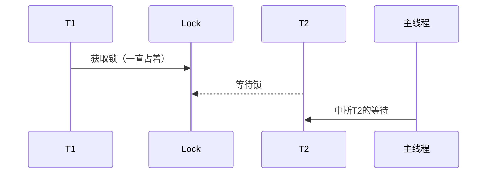
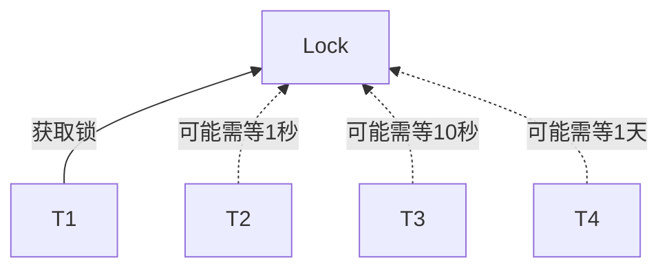

`Reentrantlock`用于代替`synchornized`，它们之间没有明显的性能差别，但是前者更灵活。

## 例一
本例子中由于`m1`锁定`this`，只有`m1`执行完毕的时候，`m2`才能执行。

```java
synchronized void m1() {
    try {
        for (int i = 0; i < 10; i++) {
            TimeUnit.SECONES.sleep(1);
            System.out.println(i);
        }
    } catch(InterruptedException e) {
        e.printStackTrace();
    }
}

synchronized void m2() {
    System.out.println("m2...");
}

public static void main(String[] args) {
    new Thread(m1).start();
    TimeUnit.SECONES.sleep(1);
    new Thread(m2).start();
}
```

## 例二
使用ReentrantLock可以完成同样的功能。

```java
private Lock lock = new ReentrantLock();

private void m1() {
    try {
        lock.lock(); // synchronized(this)
        for (int i = 0; i < 10; i++) {
            TimeUnit.SECONES.sleep(1);
            System.out.println(i);
        }
    } catch(InterruptedException e) {
        e.printStackTrace();
    } finally {
        lock.unlock();
    }
}

private void m2() {
    lock.lock();
    System.out.println("m2...");
    lock.unlock();
}

public static void main(String[] args) {
    new Thread(m1).start();
    TimeUnit.SECONES.sleep(1);
    new Thread(m2).start();
}
```

需要注意的是，必须要手工释放锁。因为使用`synchronized`锁定的话如果遇到异常，JVM会自动释放锁，但是`ReentrantLock`必须手动释放锁，因为经常在`finally`中进行锁的释放。

## 例三
`ReentrantLock`可以使用`tryLock`进行尝试锁定，不管锁定与否，方法都将继续执行，可以根据`tryLock`的返回值来判定是否锁定。

```java
private void m3() {
    boolean locked = lock.tryLock();
    System.out.println("m3...");
    if (locked) lock.unlock();
}
```

`ReentrantLock`也可以指定`tryLock`的时间，由于`tryLock(time)`会抛出异常，所以要注意`unlock`的处理，必须放到`finally`中。

```java
private void m4() {
    boolean locked = false;

    try {
        locked = lock.tryLock(5, TimeUnit.SECONDS);
        System.out.println("m4...");
    } catch(InterruptedException e) {
        e.printStackTrace();
    } finally {
        if (locked) lock.unlock();
    }
}
```

## 例四
`ReentrantLock`还可以调用`lockInterruptibly`方法，可以对线程方法做出响应，在一个线程等待锁的过程中，可以被打断。

```java
public static void main(String[] args) {
    Lock lock = new ReentrantLock();

    Thread t1 = new Thread(() -> {
        // 因为是静态方法，所以这里lock的是Class
        lock.lock();

        System.out.println("t1...");
        // 直接睡死
        TimeUnit.SECONDS.sleep(Integer.MAX_VALUE);
        
        lock.unlock();
    });
    t1.start();

    Thread t2 = new Thread(() -> {
        // 因为是静态方法，所以这里lock的是Class
        // 因为上面已经睡死了，所以这里一直等待不到锁
        lock.lock();

        System.out.println("t1...");

        lock.unlock();
    });
    t2.start();

    TimeUnit.SECONDS.sleep(1);

    // 打断线程2的等待
    // 因为t2使用的是lock，所以没法做响应。这里没法执行    
    t2.interrupt();
}
```

```java
public static void main(String[] args) {
    Lock lock = new ReentrantLock();

    Thread t1 = new Thread(() -> {
        // 因为是静态方法，所以这里lock的是Class
        lock.lock();

        System.out.println("t1...");
        // 直接睡死
        TimeUnit.SECONDS.sleep(Integer.MAX_VALUE);
        
        lock.unlock();
    });
    t1.start();

    Thread t2 = new Thread(() -> {
        // 因为是静态方法，所以这里lock的是Class
        // 这种写法可以对interrupt()作出响应
        lock.lockInterruptibly();

        System.out.println("t1...");

        lock.unlock();
    });
    t2.start();

    TimeUnit.SECONDS.sleep(1);

    // 打断线程2的等待，lockInterruptibly能响应。
    t2.interrupt();
}
```



## 例五
`ReentrantLock`还可以指定为公平锁。

默认的`synchronized`是竞争锁，没有公平性可言，有可能一个线程等待1秒就获得了锁，另外一个线程等了1天也没能获取。但是它效率高，不需要计算每个线程等了多长时间。

```java
public static void main(String[] args) {
    // 默认的竞争锁，谁得到锁看运气
    ReentrantLock lock = new ReentrantLock();

    new Thread(() -> {
        for (int i = 0; i < 100; i++) {
            lock.lock();
            System.out.println("线程一获取了锁。。。");
            lock.unlock();
        }
    }).start();

    new Thread(() -> {
        for (int i = 0; i < 100; i++) {
            lock.lock();
            System.out.println("线程二获取了锁。。。");
            lock.unlock();
        }
    }).start();
}

// 结果分布不均匀
线程一获取了锁。。。
线程一获取了锁。。。
线程一获取了锁。。。
线程一获取了锁。。。
线程二获取了锁。。。
线程二获取了锁。。。
线程一获取了锁。。。
...
```



公平锁就是谁等待的时间长，谁就更容易得到锁。

```java
public static void main(String[] args) {
    // 参数为true表示公平锁
    ReentrantLock lock = new ReentrantLock(true);

    new Thread(() -> {
        for (int i = 0; i < 100; i++) {
            lock.lock();
            System.out.println("线程一获取了锁。。。");
            lock.unlock();
        }
    }).start();

    new Thread(() -> {
        for (int i = 0; i < 100; i++) {
            lock.lock();
            System.out.println("线程二获取了锁。。。");
            lock.unlock();
        }
    }).start();
}

// 结果分布比较均匀
线程一获取了锁。。。
线程一获取了锁。。。
线程二获取了锁。。。。
线程一获取了锁。。。
线程二获取了锁。。。
线程二获取了锁。。。
线程一获取了锁。。。
...
```
