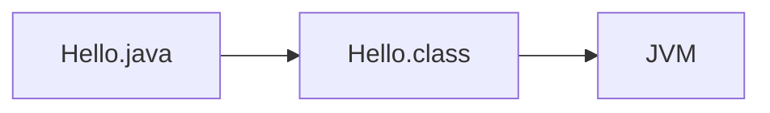
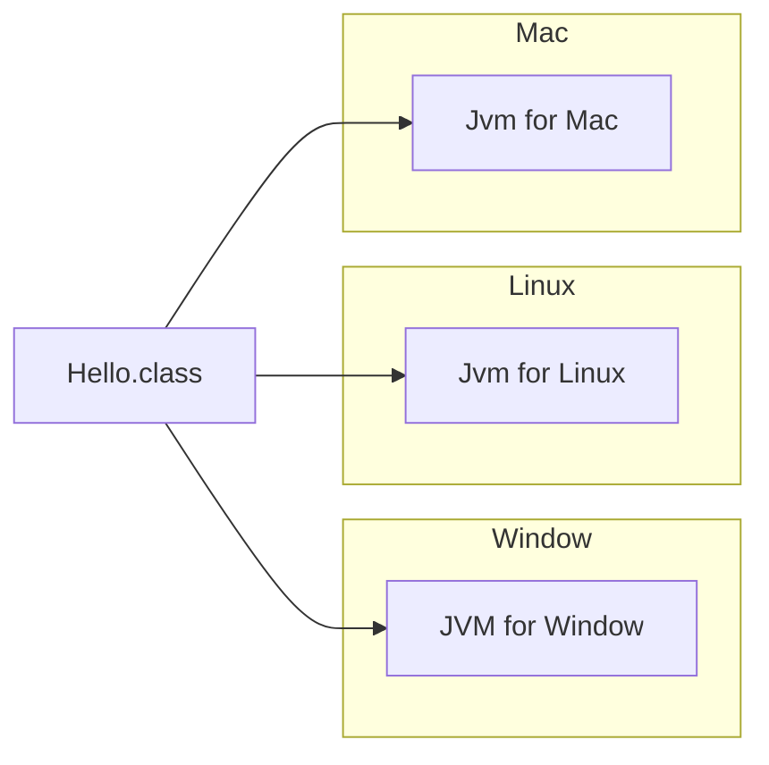
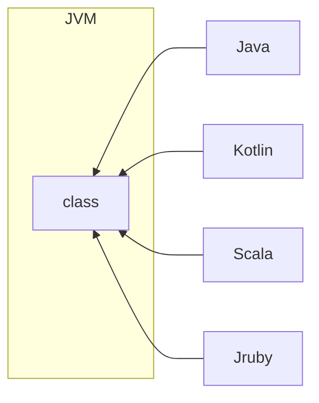
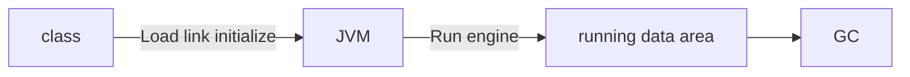
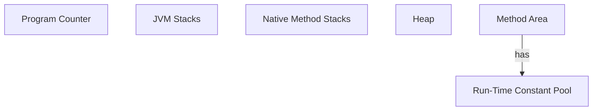
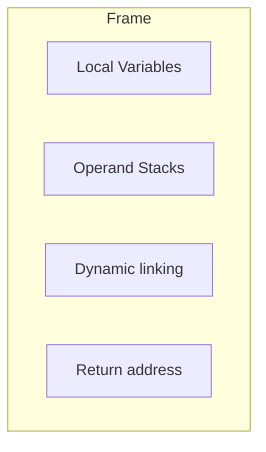
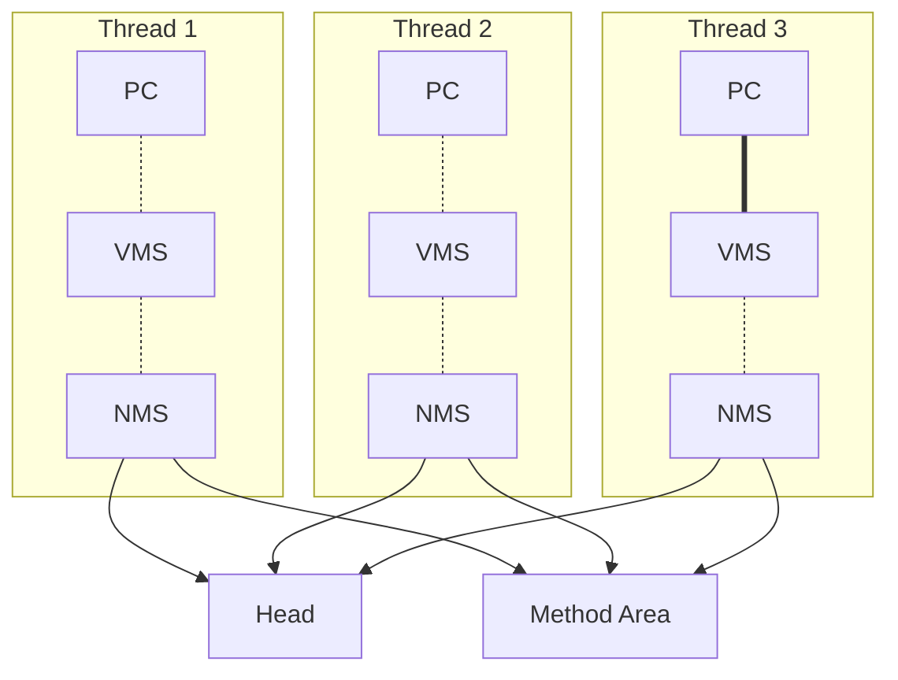

### Java的执行过程

### 跨平台的语言

### 跨语言的平台

### Java体系
Java体系非常的庞大，其中最重要的要属于Java语言本身以及Java虚拟机。

## 类的加载机制

## 运行时数据区

1. Program Counter (线程独有)
    - Each Java Virtual Machine thread has its **own** pc (Program counter) register
    - At any point, each Java Virtual Machine thread is excuting the code of a single method, namely the current method for that thread
    - If that method is not native, the pc register constains the address of the Java Virtual Machine instruction currently being executed
1. JVM Stacks (线程独有)
    - Each Java Virtual Machine thread has a **private** Java Virtual Machine stack, created at the same time as the thread
    - A Java Virtual Machine stack stores frames
1. Native Method Stacks (线程独有，访问本地方法诸如C、C++时才用到)
    - An implementation of the Java Virtual Machine may use conventional (常规的) stacks called native method stacks
1. Heap (线程共享)
    - The Java Virtual Machine has a heap that is **shared** among all Java Virtual Machine threads
    - The heap is the run-time data area from which memory for all class instances and arrays is allocated
1. Method Area (线程共享)
    - The Java Virtual Machine has a method area tha is **shared** among all Java Virtual Machine threads
    - It stores pre-class structures
1. Run-Time Constant Pool (线程共享)
    - A run-time constant pool is a pre-class or per-interface run-time representation (表现)of the constant_pool table in a class file
    - run-time constant pool is belong to Method Area

## Frame
A frame is used to store data and partial results, as well as to perform dynamic linking, return values for methods, and dispatch exceptions.

1. Each method, a frame
1. 

### How to see frame in Idea
idea to install **jclasslib** plugin.

## Return

## 问题
### 为什么需要记录当前线程的执行地址？

