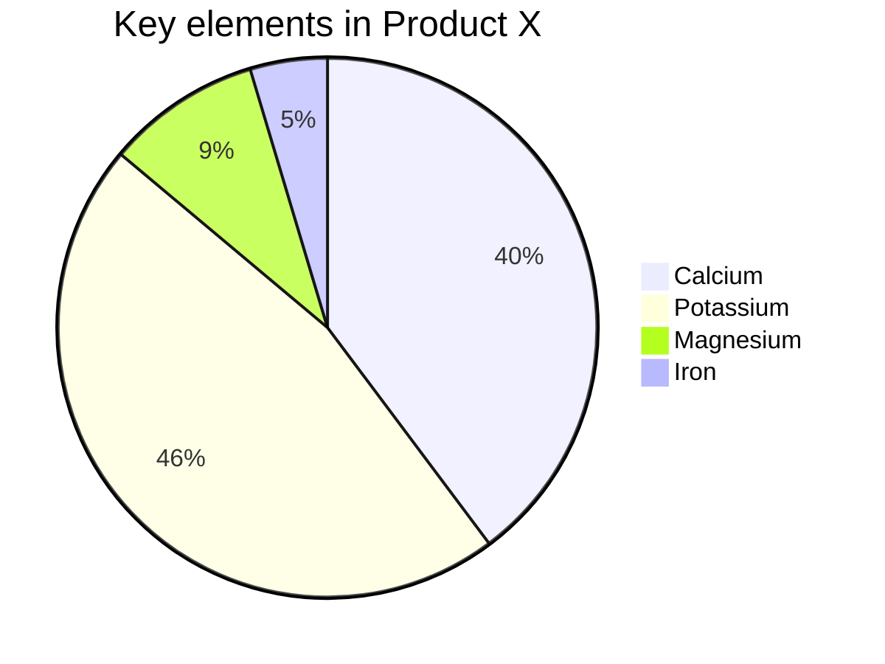

- A pie char (or a circle chart) is a circular statistical graphic, which is divided into slices to illustrate (解释) numerical proportion (比例). In a pie chart, the arc length of each slice (and consequently (因此) its central angle and area), is proportional to the quantity it represents. While it is named for its resemblance (相似) to a pie which has been sliced, there are variations on the way it can be presented. The earliest known pie chart is generally credited to William Playfair's Statistical Breviary of 1801 -Wikipedia

Mermaid can render Pie Chart diagrams.

```
pie
    title Key elements in Product X
    "Calcium" : 42.96
    "Potassium" : 50.05
    "Magnesium" : 10.01
    "Iron" :  5
```



## Syntax
Drawing a pie chart is really simple in mermaid.
1. Start with `pie` keyword to begin the diagram
1. Followed by `title` and its value in string to give a title to the pie-chart. This is *OPTIONA*
1. Followed by dataSet
    - `label` for a section in the pie diagram within `" "` quotes
    - Followed by `:` semi-colon as separator
    - Followed by positive numberic value (supproted upto tow decimal places)