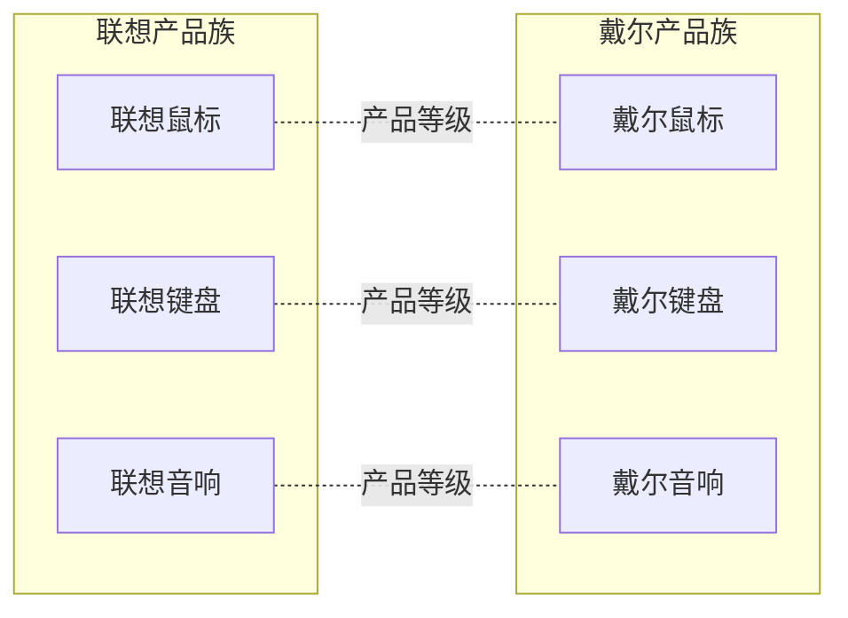

抽象工厂模式考虑多个等级产品的生产，将同一个具体工厂所生产的位于不同等级的一组产品称为一个产品族。



## 模式介绍
1. 举例说明
	畜牧场有养马场，养牛场，既售卖马、牛又售卖干草、玉米杆等饲料。	

	电器厂有格力、海尔，既生产电视机又生产洗衣机，空调等。

	大学有清华大学，北京大学，既有软件专业，又有生物专业。

1. 意图目的
	为访问类提供一个创建一组相关或相互依赖对象的接口，且访问类无须指定所要产品的具体类就能得到同族的不同等级的产品的模式结构。

1. 主要解决
    主要解决接口选择的问题。

1. 如何解决
	抽象工厂模式同样由抽象工厂、具体工厂、抽象产品、具体产品 4 个元素组成。不同的是，抽象工厂的方法个数不同，抽象产品的个数也不同。

	畜牧场是抽象工厂，可以购买动物或者饲料。

	养马场，养牛场是具体工厂。

	动物、饲料属于抽象产品，多个抽象产品组成一个产品等级。

	马、牛、羊、干草、玉米杆属于具体产品，同一个具体工厂下的产品组成一个产品族。

1. 关键代码
	有多个抽象产品，抽象工厂有多个方法来生产不同的抽象产品。

1. 何时使用
	系统中有多个产品族，每个具体工厂创建同一族但属于不同等级结构的产品。

	系统一次只可能消费其中某一族产品，即同族的产品一起使用。如有人只喜欢穿某一个品牌的衣服和鞋。

1. 优点缺点
    产品族易扩展，当增加一个新的产品族时不需要修改原代码，满足开闭原则。例如要添加养羊场这个产品族，只需创建新的具体工厂和具体产品即可，无需修改老代码。

    产品等级难扩展，当需要新增一个抽象产品时，抽象工厂需要新添加一个方法来生产它，所有的具体工厂都需要修改代码。

1. 注意事项
	抽象工厂模式是工厂方法模式的升级版本，工厂方法模式只生产一个等级的产品，而抽象工厂模式可生产多个等级的产品。

1. 应用场景

## 代码实现
假设我们有鼠标、键盘、耳机 3 类产品，然后生产商家有惠普、戴尔、华硕 3 个工厂，合计 6 个种类的产品。

1.创建产品接口及其产品实例。

```java
public interface Mouse {
    void sayHi();
}
public interface Keybo {
    void sayHi();
}
public interface Earphone {
    void sayHi();
}

// ... 实现类
```

2.创建产品的工厂
```java
// 工厂接口
public interface PcFactory {
    Mouse createMouse();
    Keybo createKeybo();
    Earphone createEarphone();
}

// 惠普工厂
public class HpFactory implements PcFactory{

    @Override
    public Mouse createMouse() {
        return new HpMouse();
    }

    @Override
    public Keybo createKeybo() {
        return new HpKeybo();
    }

    @Override
    public Earphone createEarphone() {
        return new HpEarphone();
    }
}

// ... 其它工厂
```

3.生产工厂的工厂

```java
public class FactoryProducer {

    public static PcFactory hpFacotory() {
        return new HpFactory();
    }

    public static PcFactory dellFactory() {
        return new DellFactory();
    }

    public static PcFactory asusFactory() {
        return new AsusFactory();
    }
}
```

4.使用
```java
public class Demo {
    public static void main(String[] args) {
        // 创建惠普鼠标
        FactoryProducer.hpFacotory().createMouse();
        // 创建惠普键盘
        FactoryProducer.hpFacotory().createKeybo();
         // 创建惠普耳机
        FactoryProducer.hpFacotory().createEarphone();
        // 。。。戴尔、华硕产品
    }
}
```

另外一个例子是关于农场的。

农场中除了像畜牧场一样可以养动物，还可以培养植物，如养马、养牛、种菜、种水果等，所以本实例比前面介绍的畜牧场类复杂，必须用抽象工厂模式来实现。

本例用抽象工厂模式来设计两个农场，一个是韶关农场用于养牛和种菜，一个是上饶农场用于养马和种水果，可以在以上两个农场中定义一个生成动物的方法 `newAnimal()` 和一个培养植物的方法 `newPlant()`。


1、客户端使用过程。
```java
/**
 * 客户端
 */
public class Client {
    public static void main(String[] args) {
        Farm sgFarm = new SGfarm();
        Plant plant = sgFarm.newPlant();
        Animal animal = sgFarm.newAnimal();
        plant.cost();
        animal.show();
    }
}

Fruitage need 10.10$
This is a Cattle.
```

2、定义好抽象产品和具体产品。

```java
/**
 * 动物，抽象产品
 */
public interface Animal {
    void show();
}
/**
 * 马，具体产品
 */
public class Horse implements Animal {
    @Override
    public void show() {
        System.out.println("This is a Horse.");
    }
}
/**
 * 牛，抽象产品
 */
public class Cattle implements Animal {
    @Override
    public void show() {
        System.out.println("This is a Cattle.");
    }
}

/**
 * 植物，抽象产品
 */
public interface Plant {

    void cost();
}
/**
 * 水果，具体产品
 */
public class Fruitage implements Plant {
    @Override
    public void cost() {
        System.out.println("Fruitage need 10.10$");
    }
}
/**
 * 蔬菜，具体产品
 */
public class Vegetables implements Plant{
    @Override
    public void cost() {
        System.out.println("Vegetables need 5.00$");
    }
}
```

3、抽象工厂和具体工厂。

```java
/**
 * 农场，抽象工厂
 */
public interface Farm {

    /**
     * 获取植物
     */
    Plant newPlant();

    /**
     * 获取动物
     */
    Animal newAnimal();
}
/**
 * 韶关农场，具体工厂
 */
public class SGfarm implements Farm {

    @Override
    public Plant newPlant() {
        return new Fruitage();
    }

    @Override
    public Animal newAnimal() {
        return new Cattle();
    }
}
/**
 * 上饶农场，具体工厂
 */
public class SRfarm implements Farm {

    @Override
    public Plant newPlant() {
        return new Vegetables();
    }

    @Override
    public Animal newAnimal() {
        return new Horse();
    }
}
```

4、现在模拟新增产品族。
```java
/**
 * 广州农场，具体工厂
 */
public class GZfarm implements Farm {

    @Override
    public Plant newPlant() {
        return new Vegetables();
    }

    @Override
    public Animal newAnimal() {
        return new Cattle();
    }
}

/**
 * 客户端
 */
public class Client {
    public static void main(String[] args) {
        Farm gzFarm = new GZfarm();
        Plant plant = gzFarm.newPlant();
        Animal animal = gzFarm.newAnimal();
        plant.cost();
        animal.show();
    }
}

Vegetables need 5.00$
This is a Cattle.
```

5、现在模拟新增产品等级。

```java
/**
 * 饲料，抽象产品
 */
public interface Feed {

    void weight();
}
/**
 * 干草，具体产品
 */
public class Hay implements Feed {

    @Override
    public void weight() {
        System.out.println("Hay is 20kg weight.");
    }
}
/**
 * 玉米杆，具体产品
 */
public class Cornstalk implements Feed {

    @Override
    public void weight() {
        System.out.println("Cornstalk is 20kg weight.");
    }
}
/**
 * 农场，抽象工厂
 */
public interface Farm {

    /**
     * 获取植物
     */
    Plant newPlant();

    /**
     * 获取动物
     */
    Animal newAnimal();

    /**
     * 获取饲料
     */
    Feed newFeed();
}
// ... 具体工厂修改

/**
 * 客户端
 */
public class Client {
    public static void main(String[] args) {
        Farm gzFarm = new GZfarm();
        Plant plant = gzFarm.newPlant();
        Animal animal = gzFarm.newAnimal();
        Feed feed = gzFarm.newFeed();
        plant.cost();
        animal.show();
        feed.weight();
    }
}
```
## JDK 源码

## Spring 源码