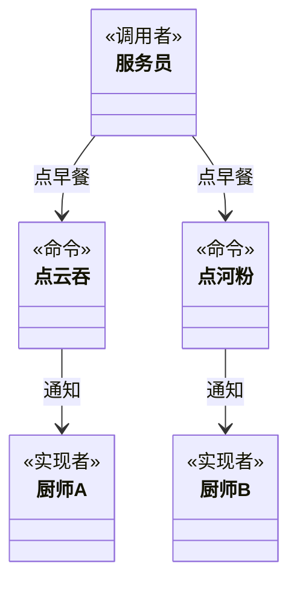

在软件开发系统中，常常出现“方法的请求者”与“方法的实现者”之间存在紧密的耦合关系。这不利于软件功能的扩展与维护。例如，想对行为进行“撤销、重做、记录”等处理都很不方便，因此“如何将方法的请求者与方法的实现者解耦？”变得很重要，命令模式能很好地解决这个问题。

在现实生活中，这样的例子也很多，例如，电视机遥控器（命令发送者）通过按钮（具体命令）来遥控电视机（命令接收者），还有计算机键盘上的“功能键”等。

## 模式介绍
命令模式是将一个请求封装为一个对象，使发出请求的责任和执行请求的责任分割开。这样两者之间通过命令对象进行沟通，这样方便将命令对象进行储存、传递、调用、增加与管理。

#### 举例说明
客户去餐馆可选择的早餐有肠粉、河粉和馄饨等，客户可向服务员选择以上早餐中的若干种，服务员将客户的请求交给相关的厨师去做。这里的点早餐相当于“命令”，服务员相当于“调用者”，厨师相当于“接收者”，所以用命令模式实现比较合适。

#### 主要解决

#### 模式原理
命令模式包含以下主要角色：
1. 抽象命令：声明执行命令的接口，拥有执行命令的抽象方法 execute()。
1. 具体命令：是抽象命令类的具体实现类，它拥有接收者对象，并通过调用接收者的功能来完成命令要执行的操作。
1. 实现者/接收者：执行命令功能的相关操作，是具体命令对象业务的真正实现者。
1. 调用者/请求者：是请求的发送者，它通常拥有很多的命令对象，并通过访问命令对象来执行相关请求，它不直接访问接收者。

在餐馆的例子中，服务区相当于调用者，点早餐相当于“命令”，厨师相当于“接收者”。



#### 关键代码
```java
/*
 * Waiter是调用者
 */
public class Waiter {
    public static void main() {
        // Command是抽象命令，Hefen是具体命令
        Command hefen = new Hefen();
        // 调用命令类中的命令
        hefen.cooking();
    }
}

public class Hefen implements Command {
    // 命令类里面持有一个实现类。
    private HefenChelf chelf = new HefenChelf();

    @Override
    public void cooking() {
        chelf.cookingHefen();
    }
}
```

#### 使用场景
命令模式通常适用于以下场景：
1. 当系统需要将请求调用者与请求接收者解耦时，命令模式使得调用者和接收者不直接交互。
1. 当系统需要随机请求命令或经常增加或删除命令时，命令模式比较方便实现这些功能。
1. 当系统需要执行一组操作时，命令模式可以定义宏命令来实现该功能。
1. 当系统需要支持命令的撤销（Undo）操作和恢复（Redo）操作时，可以将命令对象存储起来，采用备忘录模式来实现。

#### 优点缺点
命令模式的主要优点如下：
1. 降低系统的耦合度。命令模式能将调用操作的对象与实现该操作的对象解耦。
1. 增加或删除命令非常方便。采用命令模式增加与删除命令不会影响其他类，它满足“开闭原则”，对扩展比较灵活。
1. 可以实现宏命令。命令模式可以与组合模式结合，将多个命令装配成一个组合命令，即宏命令。
1. 方便实现 Undo 和 Redo 操作。命令模式可以与后面介绍的备忘录模式结合，实现命令的撤销与恢复。

其缺点是：可能产生大量具体命令类。因为计对每一个具体操作都需要设计一个具体命令类，这将增加系统的复杂性。

#### 注意事项

#### 模式扩展
在软件开发中，有时将命令模式与前面学的组合模式联合使用，这就构成了宏命令模式，也叫组合命令模式。宏命令包含了一组命令，它充当了具体命令与调用者的双重角色，执行它时将递归调用它所包含的所有命令。

## 代码实现
用命令模式实现客户去餐馆吃早餐的实例。

分析：客户去餐馆可选择的早餐有肠粉、河粉和馄饨等，客户可向服务员选择以上早餐中的若干种，服务员将客户的请求交给相关的厨师去做。这里的点早餐相当于“命令”，服务员相当于“调用者”，厨师相当于“接收者”，所以用命令模式实现比较合适。

首先，定义一个早餐类（Breakfast），它是抽象命令类，有抽象方法 cooking()，说明要做什么；再定义其子类肠粉类（ChangFen）、馄饨类（HunTun）和河粉类（HeFen），它们是具体命令类，实现早餐类的 cooking() 方法，但它们不会具体做，而是交给具体的厨师去做；具体厨师类有肠粉厨师（ChangFenChef）、馄蚀厨师（HunTunChef）和河粉厨师（HeFenChef），他们是命令的接收者。最后，定义服务员类（Waiter），它接收客户的做菜请求，并发出做菜的命令。客户类是通过服务员类来点菜的。

#### 调用者
服务员作为调用者角色，接收客户的做菜请求，并发出做菜的命令。
```java
public class Waiter {
    public static void main(String[] args) {
        // 早餐：河粉
        Breakfast hefen = new Hefen();
        hefen.cooking();

        // 早餐：肠粉
        Breakfast changfen = new Changfen();
        changfen.cooking();
    } 
}
```

#### 命令类
早餐类作为抽象命令类，有个抽象方法 `cooking()`。具体命令类有肠粉类，馄饨类和河粉类，实现了 `cooking()` 方法，但它们不会具体做，而是交给厨房（实现类）去做。
```java
public interface Breakfast {
    void cooking();
}

public class Hefen implements Breakfast {
    private HefenChef = new HefenChef();

    @Override
    public void cooking() {
        chef.cookingHefen();
    }
}

public class Changfen implements Breakfast {
    private ChangFenChef chef = new ChangFenChef();

    @Override
    public void cooking() {
        chef.cookingChangefen();
    }
}
```

#### 实现类
实现类是负责命令的最终实现。

```java
public class HefenChef {
    pbulic void cookingHefen() {
        System.out.println("厨师正在做河粉。。。");
    }
}

public class ChangFenChef {
    pbulic void cookingChangefen() {
        System.out.println("厨师正在做肠粉。。。");
    }
}
```

## JDK 中的命令模式

## Spring 中的命令模式