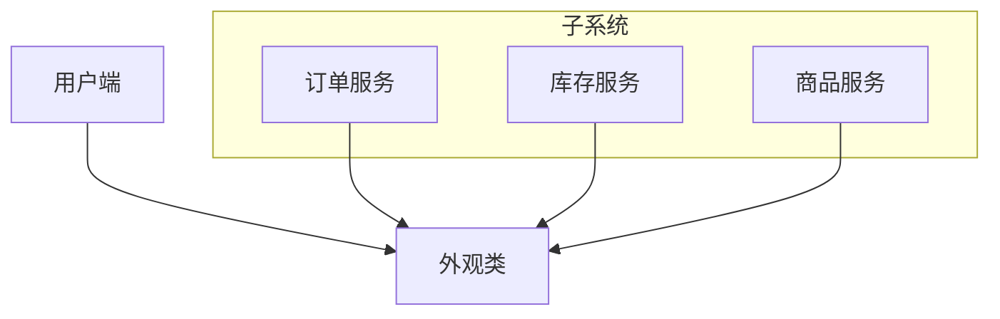

## 模式介绍
1. 举例说明
    安装软件常常有一键安装选项，省去选择安装目录、安装组件等操作。

    手机的重启按钮将重启和关机的功能整合在一起。

1. 意图目的
    外观模式也叫门面模式，通过定义一个一致的接口，用以屏蔽内部子系统的细节，使得调用端只需跟这个接口发生调用，而无需关系这个子系统的内部细节。

1. 主要解决
    解决多个复杂接口带来的使用困难，起到简化用户操作的作用。

1. 如何解决
    调用者：外观接口的调用者。

    外观类：为调用端提供统一的接口。外观类知道哪些子系统负责处理请求，从而将调用端的请求代理给适当的子系统对象。

    子系统：一个或多个系统，处理外观类指派的任务，它是功能的提供者。

1. 何时使用
    当系统需要进行分层设计时，可以考虑使用外观模式。

    维护老系统时，如果这个系统已经变得非常难以维护和扩展，可以考虑为新系统开发一个外观类，来提供老系统的比较清晰简单的接口。让新系统与外观类交互，提供复用性。

1. 优点缺点
    对外屏蔽了子系统的细节，降低客户端对子系统使用的复杂性。

    外观模式降低了客户端对子系统的耦合关系，让子系统内部的模块更容易维护和扩展。

    通过合理的使用外观模式，可以帮我们更好的划分访问层次。

1. 注意事项
    不能滥用外观模式，只有当系统过于复杂时，才考虑使用。

## 代码实现

## JDK 中的外观模式

## Spring 中的外观模式