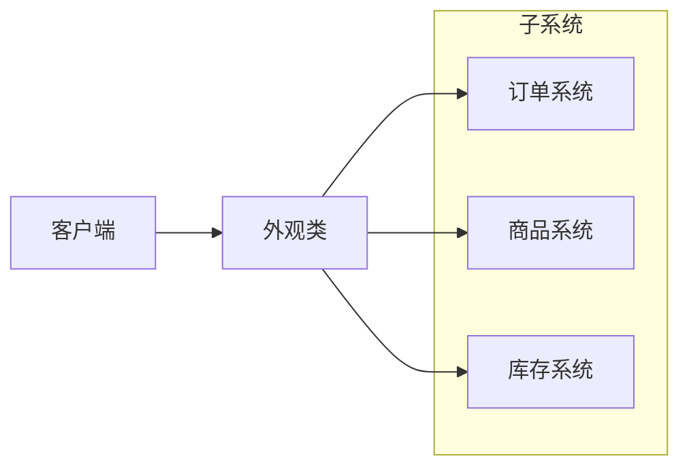

在现实生活中，常常存在办事较复杂的例子，如办房产证或注册一家公司，有时要同多个部门联系，这时要是有一个综合部门能解决一切手续问题就好了。

软件设计也是这样，当一个系统的功能越来越强，子系统会越来越多，客户对系统的访问也变得越来越复杂。这时如果系统内部发生改变，客户端也要跟着改变，这违背了“开闭原则”，也违背了“迪米特法则”，所以有必要为多个子系统提供一个统一的接口，从而降低系统的耦合度，这就是外观模式的目标。

## 模式介绍
1. 举例说明
    买房需要办理一系列手续，这时通过中介代办。

    安装软件常常有一键安装选项，省去选择安装目录、安装组件等操作。

1. 意图目的
    外观模式也叫门面模式，通过定义一个一致的接口，用以屏蔽内部子系统的细节，使得调用端只需跟这个接口发生调用，而无需关系这个子系统的内部细节。

1. 主要解决
    解决多个复杂接口带来的使用困难，起到简化用户操作的作用。

1. 如何解决
    调用者：外观接口的调用者。

    外观类：为调用端提供统一的接口。外观类知道哪些子系统负责处理请求，从而将调用端的请求代理给适当的子系统对象。

    子系统：一个或多个系统，处理外观类指派的任务，它是功能的提供者。

    买房的例子中，中介就是外观类，每个手续都是一个子系统。
    
1. 何时使用
    当客户端与多个子系统之间存在很大的联系时，引入外观模式可将它们分离，从而提高子系统的独立性和可移植性。

    维护老系统时，如果这个系统已经变得非常难以维护和扩展，可以考虑为新系统开发一个外观类，来提供老系统的比较清晰简单的接口。让新系统与外观类交互，提供复用性。

1. 优点缺点
    通过合理的使用外观模式，可以帮我们更好的划分访问层次。

    对外屏蔽了子系统的细节，降低客户端对子系统使用的复杂性。

    外观模式降低了客户端对子系统的耦合关系，让子系统内部的模块更容易维护和扩展。

    不能很好地限制客户使用子系统类。

    增加新的子系统可能需要修改外观类或客户端的源代码，违背了“开闭原则”。

1. 注意事项
    不能滥用外观模式，只有当系统过于复杂时，才考虑使用。

1. 应用场景

## 代码实现

## JDK 中的外观模式

## Spring 中的外观模式