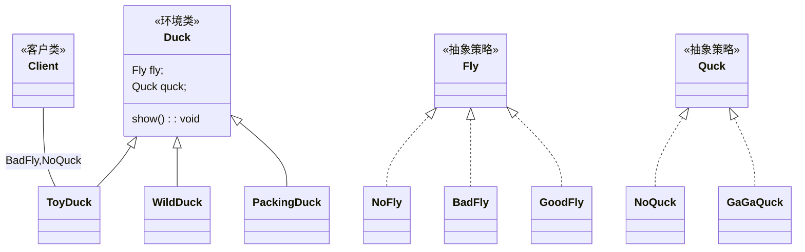

在现实生活中常常遇到实现某种目标存在多种策略可供选择的情况，例如，出行旅游可以乘坐飞机、乘坐火车、骑自行车或自己开私家车等，超市促销可以釆用打折、送商品、送积分等方法。

在软件开发中也常常遇到类似的情况，当实现某一个功能存在多种算法或者策略，我们可以根据环境或者条件的不同选择不同的算法或者策略来完成该功能，如数据排序策略有冒泡排序、选择排序、插入排序、二叉树排序等。

如果使用多重条件转移语句实现（即硬编码），不但使条件语句变得很复杂，而且增加、删除或更换算法要修改原代码，不易维护，违背开闭原则。如果采用策略模式就能很好解决该问题。



## 模式介绍
1. 举例说明
    数据排序策略有冒泡排序、选择排序、插入排序、二叉树排序等。

1. 意图目的
    该模式定义了一系列算法，并将每个算法封装起来，使它们可以相互替换，且算法的变化不会影响使用算法的客户。策略模式属于对象行为模式，它通过对算法进行封装，把使用算法的责任和算法的实现分割开来，并委派给不同的对象对这些算法进行管理。

1. 主要解决
    实现某一个功能存在多种算法或者策略。

1. 如何解决
    抽象策略：定义了一个公共接口，各种不同的算法以不同的方式实现这个接口，环境角色使用这个接口调用不同的算法，一般使用接口或抽象类实现。

    具体策略：实现了抽象策略定义的接口，提供具体的算法实现。

    环境类：持有一个策略类的引用，最终给客户端调用。

    客户类：客户可以指定环境类使用哪些策略。

1. 关键代码
    环境类持有抽象策略，实现的时候设置上具体策略。

1. 何时使用

1. 优点缺点
    多重条件语句不易维护，而使用策略模式可以避免使用多重条件语句。

    策略模式提供了一系列的可供重用的算法族，恰当使用继承可以把算法族的公共代码转移到父类里面，从而避免重复的代码。

    策略模式可以提供相同行为的不同实现，客户可以根据不同时间或空间要求选择不同的。

    策略模式提供了对开闭原则的完美支持，可以在不修改原代码的情况下，灵活增加新算法。

    策略模式把算法的使用放到环境类中，而算法的实现移到具体策略类中，实现了二者的分离。

    策略模式造成很多的策略类。

    客户端必须理解所有策略算法的区别，以便适时选择恰当的算法类。

1. 注意事项
    多用组合/聚合，少用继承；用行为类组合，而不是行为的继承。更有弹性。

1. 应用场景

1. 模式扩展

## 代码实现
编写鸭子项目，要求如下：
1. 有各种鸭子，比如野鸭、北京鸭、玩具鸭等。
1. 鸭子有各种行为如叫、飞行、游戏等。
1. 显示鸭子的信息。


1、使用。
```java
public class Client {

    public static void main(String[] args) {
        // 野鸭
        Duck wildDuck = new WildDuck();
        wildDuck.show();

        // 玩具鸭
        Duck toyDuck = new ToyDuckDuck();
        toyDuck.show();

        // 自定义鸭子
        Duck personalDuck = new Duck("烤鸭仔", new NoFlyBehavior(), new GuoGuoQuackBehavior());
        personalDuck.show();
    }
}
野鸭子 飞的很好 嘎嘎叫
玩具鸭 不会飞的 嘎嘎叫
烤鸭仔 不会飞的 蝈蝈叫
```

2、环境类，持有策略。

```java
/**
 * 抽象鸭子，有名字，有飞行技巧，叫声等属性。
 */
public class Duck {

    private String name;

    // 策略接口-飞行
    private FlyBehavior flyBehavior;
    // 策略接口-叫声
    private QuackBehavior quackBehavior;

    public Duck(String name, FlyBehavior flyBehavior, QuackBehavior quackBehavior) {
        this.name = name;
        this.flyBehavior = flyBehavior;
        this.quackBehavior = quackBehavior;
    }

    public void show() {
        System.out.println(name + " " + flyBehavior.fly() + " " + quackBehavior.quck());
    }
}

/**
 * 野鸭
 */
public class WildDuck extends Duck {

    public WildDuck() {
        super("野鸭子", new GoodFlyBehavior(), new GaGaQuackBehavior());
    }
}

/**
 * 玩具鸭
 */
public class ToyDuckDuck extends Duck {

    public ToyDuckDuck() {
        super("玩具鸭", new NoFlyBehavior(), new GaGaQuackBehavior());
    }
}
```

3、抽象策略和具体策略。

```java

/**
 * 抽象策略-飞行技巧
 */
public interface FlyBehavior {
    String fly();
}
/**
 * 具体策略
 */
public class NoFlyBehavior implements FlyBehavior {
    public String fly() {
        return "不会飞的";
    }
}
/**
 * 具体策略
 */
public class BadFlyBehavior implements FlyBehavior {
    public String fly() {
        return "勉强能飞";
    }
}
/**
 * 具体策略
 */
public class GoodFlyBehavior implements FlyBehavior {
    public String fly() {
        return "飞的很好";
    }
}
/**
 * 抽象策略-叫声
 */
public interface QuackBehavior {
    String quck();
}
...
```

## JDK 中的策略模式

JDK 中的 `Arrays` 的 `Comparator` 使用了策略模式。

```java
// 客户类，给环境类指定一个策略。
Arrays.sort(new Integer[]{1, 2, 3, 4}, intCompartor);


// Comparator是抽象策略，intCompartor是具体策略。
Comparator<Integer> intCompartor = new Comparator<Integer>() {
    // 匿名内部类，具体策略
    public int compare(Integer o1, Integer o2) {
        return o1 > o2 ? 1 : 0;
    }
};

// 环境类
public static <T> void sort(T[] a, Comparator<? super T> c) {
    if (c == null) {
        sort(a);
    } else {
        if (LegacyMergeSort.userRequested)
            legacyMergeSort(a, c);
        else
            TimSort.sort(a, 0, a.length, c, null, 0, 0);
    }
}
```

## Spring 中的策略模式