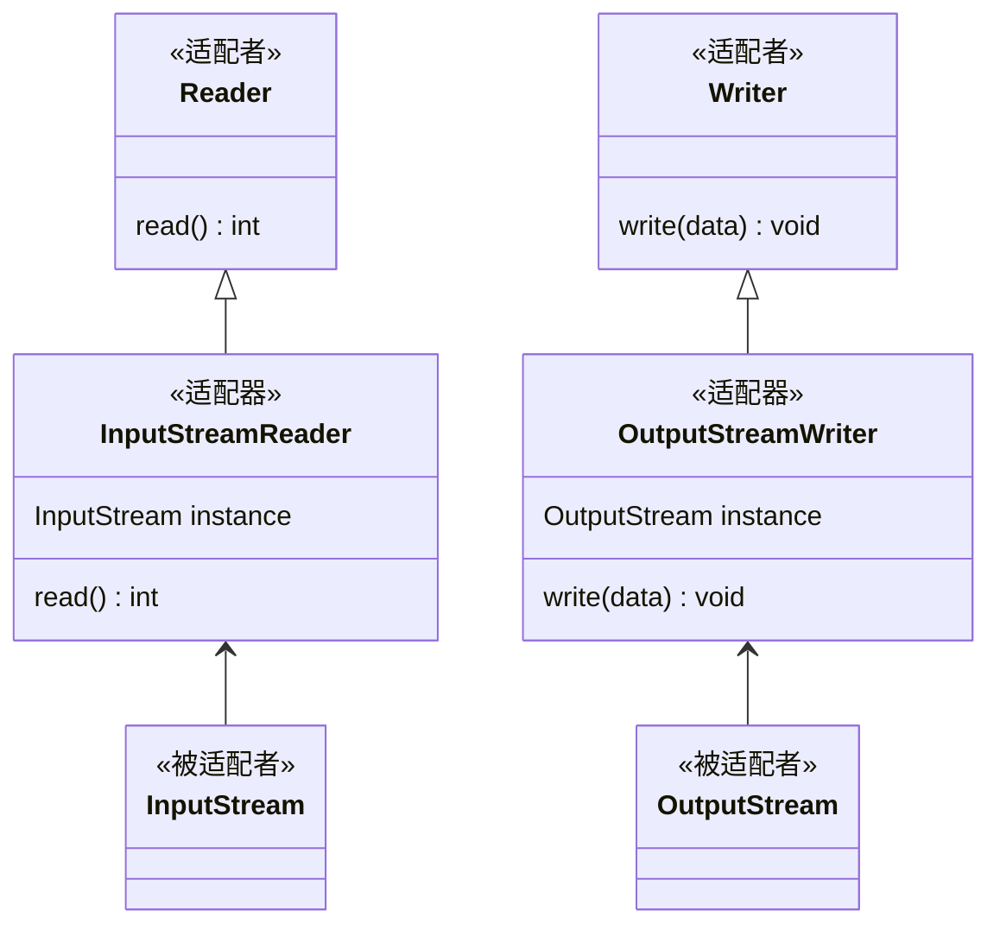

在现实生活中，经常出现两个对象因接口不兼容而不能在一起工作的实例，这时需要第三者进行适配。例如，讲中文的人同讲英文的人对话时需要一个翻译，用直流电的笔记本电脑接交流电源时需要一个电源适配器，用计算机访问照相机的 SD 内存卡时需要一个读卡器等。

在软件设计中也可能出现：需要开发的具有某种业务功能的组件在现有的组件库中已经存在，但它们与当前系统的接口规范不兼容，如果重新开发这些组件成本又很高，这时用适配器模式能很好地解决这些问题。

## 模式介绍
1. 举例说明
    电脑能通过读卡器读取SD卡数据，现在要电脑支持读取TF卡数据。

    讲中文的人和讲英文的人对话时需要一个翻译。

1. 意图目的
    将一个类的接口转换成客户希望的另外一个接口，使得原本由于接口不兼容而不能一起工作的那些类能一起工作。
    
1. 主要解决
    复用老系统的组件。

1. 如何解决
    适配器模式中有适配者、被适配者、适配器 3 种角色。

    在上面例子中，SD卡就是适配者，系统可以直接读取其数据。

    TF卡就是被兼容者，系统不能直接读取其数据。

    适配器模仿适配者的形式打造，但是里面的内容是TF卡，欺骗系统是SD卡。

1. 关键代码
    适配器作为适配者的子类，让系统误以为是适配者。

    适配器持有一个被适配者，来个狸猫换太子。

1. 何时使用
    使用第三方提供的组件，但组件接口定义和自己要求的接口定义不一致。

    以前开发的系统存在满足新系统功能需求的类，但其接口通新系统不一致。

1. 优点缺点
    复用了现存的类，程序员不需要修改原有代码而重用现有的适配者类。

    将目标类和适配者类解耦，解决了目标类和适配者类接口不一致的问题。

    过多地使用适配器，会让系统非常零乱，不易整体进行把握。

1. 注意事项
    适配器模式不是在详细设计时添加的，而是解决正在服役的项目的问题，是一种妥协。

1. 应用场景
    Java `Reader` `InputStreamReader` `InputStream`

## 代码实现
计算机通过读卡器去读取TF卡。

1、计算机已经支持了读取SD卡功能。

```java
public class Client {

    public static void main(String[] args) {
        Computer computer = new Computer();
        SDcard sdcard = new SDcard();
        String data = computer.read(sdcard);
        System.out.println(data);
    }
}
/**
 * 电脑
 */
class Computer {
    String read(SDcard sdcard) {
        return sdcard.read();
    }
}
/**
 * SD 内存卡
 */
class SDcard {

    String read() {
        return "1001010";
    }

    void write(String data) {
        System.out.println("Writing " + data + " in SDcard...");
    }
}

/**
 * TF 内存卡只能读，不能写
 */
class TFCard {

    String read() {
        return "1001010";
    }
}
```

2、接下来在不改变计算机读取SD卡接口的情况下，通过适配器模式读取TF卡。

```java
public class Client {

    public static void main(String[] args) {
        Computer computer = new Computer();
        TFCard tfCard = new TFCard();
        TFCardAdapter tfCardAdapter = new TFCardAdapter(tfCard);
        computer.read(tfCardAdapter);
    }
}

/**
 * TF 内存卡只能读，不能写
 */
class TFCard {

    String read() {
        return "1001010";
    }
}

/**
 * 适配器
 */
class TFCardAdapter extends SDcard {

    private TFCard tfCard;

    TFCardAdapter(TFCard tfCard) {
        this.tfCard = tfCard;
    }

    @Override
    String read() {
        return tfCard.read();
    }

    @Override
    void write(String data) {
        throw new UnsupportedOperationException();
    }
}
```

## JDK 中的适配器模式

在 Java 中，`InputStreamReader` 和 `OutputStreamWriter` 都使用到了适配器模式。



```java
// 被适配者，与现有的系统不兼容
InputStream stream = new FileInputStream("");

// 适配器将被适配者转换成为适配者
Reader reader = new InputStreamReader(stream);

// 适配者与系统兼容
reader.read();

// 适配者源码
public abstract class Reader implements Readable, Closeable {
    public int read() throws IOException {
        char cb[] = new char[1];
        if (read(cb, 0, 1) == -1)
            return -1;
        else
            return cb[0];
    }
}

// 适配器源码
public class InputStreamReader extends Reader {
    // 适配器持有一个被适配者
    private final StreamDecoder sd;

    // 适配器构造函数需要将被适配者传入
    public InputStreamReader(InputStream in) {
        super(in);
        try {
            sd = StreamDecoder.forInputStreamReader(in, this, (String)null); // ## check lock object
        } catch (UnsupportedEncodingException e) {
            // The default encoding should always be available
            throw new Error(e);
        }
    }


    // 适配器重写了适配者的方法，使其兼容被适配者
    public int read() throws IOException {
        return sd.read();
    }
}

// 被适配者源码
public abstract class InputStream {
    public abstract int read() throws IOException;
}
```
## Spring 中的适配器模式