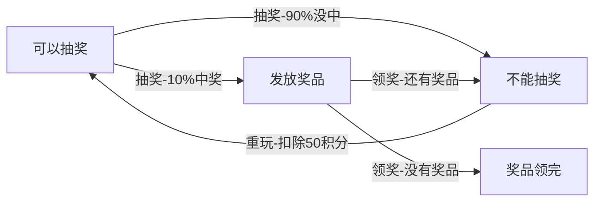

## 模式介绍
1. 举例说明
    抽奖活动，多种状态。

1. 意图目的
    主要用来解决对象在多种状态转换时，需要对外输出不同的行为和问题。状态和行为一一对应，状态之间可以相互转换。

    当一个对象的内在状态改变时，允许改变其行为，这个对象看起来像是改变了其类。

1. 主要解决


1. 如何解决
    环境类：用于维护状态实例，这个实例定义了当前状态。
    抽象状态：抽象的状态角色，定义了一个接口封装与环境类的一个特定接口相关行为。
    具体状态：每个状态子类试了一个与环境类的一个状态相关行为。
    客户类：使用环境类的。

1. 何时使用
    当一个事件或者对象有很多状态，状态之间相互转换，对不同的状态要求不同的行为的时候，可以考虑使用状态模式。

1. 优点缺点

    代码具有很强的可读性。状态模式将每个状态的行为封装到对应的一个类中。

    方便维护，将容易产生问题的 if/else 语句删除了。如果把每个状态的行为都放到一个类中，每次调用方法时都要判断当前是什么状态，不但会产生很多 if/else 语句，而且容易出错。

    符合“开闭原则”，容易增删状态。

    会产生很多类，每个状态都要对应一个类，加大维护难度。

1. 注意事项

1. 应用场景
    订单状态。

1. 模式扩展

## 代码实现
请编写程序完成 APP 抽奖活动，具体要求如下：
1. 假如没参加一次这个活动要扣除用户 50 积分，中奖概率为 10%。
1. 奖品数量固定，抽完就不能抽奖。
1. 活动有四个状态：可以抽奖、不能抽奖、发放奖品和奖品领完。
1. 活动的四个状态转换关系如下图。



1、客户类。
```java
public class Client {
    public static void main(String[] args) {
        // 创建一个活动，投放2个奖品
        Activity activity = new Activity(2);

        for (int i = 1; i <= 5; i++) {
            System.out.println("第 " + i + " 次玩。。。");
            activity.deduce();
            Boolean flag = activity.raffle();
            if (flag) {
                activity.dispense();
            }
        }
    }
}
第 1 次玩。。。
扣除积分成功，您可以抽奖了！
正在抽奖，请稍等！
很遗憾您没有中奖！
第 2 次玩。。。
扣除积分成功，您可以抽奖了！
正在抽奖，请稍等！
很遗憾您没有中奖！
第 3 次玩。。。
扣除积分成功，您可以抽奖了！
正在抽奖，请稍等！
恭喜您中奖了，请领取奖品！
领取奖品成功，剩余奖品数为：1
第 4 次玩。。。
扣除积分成功，您可以抽奖了！
正在抽奖，请稍等！
恭喜您中奖了，请领取奖品！
领取奖品成功，剩余奖品数为：0
第 5 次玩。。。
奖品已经发完，游戏结束。
奖品已经发完，游戏结束。
```

2、环境类。

```java
/**
 * 环境类，含有所有的状态类。
 *
 * 各个状态子类也含有环境类。
 */
@Data
public class Activity {

    // 奖品数量
    private Integer prizes;

    private State currentState;

    private OverState overState;

    private NoRaffleState noRaffleState;

    private CanRaffleState canRaffleState;

    private DispenseState dispenseState;

    public Activity(Integer prizes) {
        this.prizes = prizes;

        this.overState = new OverState(this);
        this.dispenseState = new DispenseState(this);
        this.noRaffleState = new NoRaffleState(this);
        this.canRaffleState = new CanRaffleState(this);

        this.currentState = this.noRaffleState;
    }

    // 抽奖-10%概率中奖，90%概率没中奖
    public Boolean raffle() {
        return currentState.raffle();
    }

    // 重玩-扣除积分
    public void deduce() {
        currentState.deduce();
    }

    // 领奖-奖品数量减少
    public void dispense() {
        currentState.dispense();
    }
}
```

3、抽象状态和具体状态。

```java
/**
 * 抽象状态-定义所有行为
 */
public interface State {
    // 抽奖-10%概率中奖，90%概率没中奖
    Boolean raffle();

    // 重玩-扣除积分
    void deduce();

    // 领奖-奖品数量减少
    void dispense();
}
/**
 * 具体状态-不能抽奖
 */
@Data
public class NoRaffleState implements State {

    private Activity activity;

    public NoRaffleState(Activity activity) {
        this.activity = activity;
    }

    // 当前状态不能抽奖
    public Boolean raffle() {
        System.out.println("扣了积分才能抽奖哦！");
        return false;
    }

    // 当前状态可以扣积分，扣除后，将状态设置为可以抽奖状态。
    public void deduce() {
        System.out.println("扣除积分成功，您可以抽奖了！");
        activity.setCurrentState(activity.getCanRaffleState());
    }

    // 当前状态不能发奖品
    public void dispense() {
        System.out.println("不能发放奖品！");
    }
}
/**
 * 具体状态-可以抽奖
 */
@Data
public class CanRaffleState implements State {

    private Activity activity;

    public CanRaffleState(Activity activity) {
        this.activity = activity;
    }

    // 可以抽奖状态，用户可以进行抽奖行为。
    public Boolean raffle() {
        System.out.println("正在抽奖，请稍等！");

        // 抽奖结果
        Boolean flag = new Random().nextBoolean();
        System.out.println(flag ? "恭喜您中奖了，请领取奖品！" : "很遗憾您没有中奖！");

        // 状态转移，如果已经中奖了则转为领取奖品状态，没中奖则为不能抽奖状态。
        activity.setCurrentState(flag ? activity.getDispenseState() : activity.getNoRaffleState());

        return flag;
    }

    // 可以抽奖状态，用户不能进行扣除积分行为。
    public void deduce() {
        System.out.println("已经扣取过积分了！");
    }

    // 可以抽奖状态，用户不能进行领奖行为。
    public void dispense() {
        System.out.println("没有中奖，不能发放奖品！");
    }
}
/**
 * 具体状态-发放奖品
 */
@Data
public class DispenseState implements State {

    private Activity activity;

    public DispenseState(Activity activity) {
        this.activity = activity;
    }

    // 发放奖品状态，不能进行抽奖行为
    public Boolean raffle() {
        System.out.println("请先领取奖品！");
        return false;
    }

    // 发放奖品状态，不能进行扣除积分行为
    public void deduce() {
        System.out.println("请先领取奖品！");
    }

    // 发放奖品状态，可以领取奖品，并进入下一状态。
    public void dispense() {
        activity.setPrizes(activity.getPrizes() - 1);

        System.out.println("领取奖品成功，剩余奖品数为：" + activity.getPrizes());

        activity.setCurrentState(activity.getPrizes() > 0 ? activity.getNoRaffleState() : activity.getOverState());
    }
}
/**
 * 具体状态-奖品领完
 */
@Data
public class OverState implements State {
    private Activity activity;

    public OverState(Activity activity) {
        this.activity = activity;
    }

    public Boolean raffle() {
        System.out.println("奖品已经发完，游戏结束。");
        return false;
    }

    public void deduce() {
        System.out.println("奖品已经发完，游戏结束。");
    }

    public void dispense() {
        System.out.println("奖品已经发完，游戏结束。");
    }
}
```

## 借贷平台源码解析
某贷平台的订单，有审核-发布-抢单等步骤，随着操作的不同，会改变订单的状态。项目中的这个模块实现使用到了状态模式。

|状态/事件|电审审核|电审失败|定价发布|接单|接单失效|付款|支付失败|反馈|
| :- |
|订单生成|已审核|已完结|||||||
|已审核|||已发布||||||
|已发布||||待付款|已完结||||
|待付款||||||已付款|已完结||
|已完结||||||||已完结|

1、通过 if/else 判断订单状态，从而实现不同的逻辑，伪代码如下：

```
if (审核) {
    // 审核逻辑
} else if (发布) {
    // 发布逻辑
} else if (接单) {
    // 接单逻辑
}
```

问题分析：这类代码难以应对变化，在添加一种状态时，我们需要手动添加 if/else，在添加一种功能时，要对所有的状态进行判断。因此代码会变得越来越臃肿，并且一旦没有处理某个状态，便会发生极其严重的 Bug，难以维护。

2、使用状态模式完成借贷平台项目的审核模块。


```java
// 客户类，使用过程。
public class Client {
    public static void main(String[] args) {
        // 1.1 创建上下文对象，该对象会记录当前处于什么状态。
        Context context = new Context();

        // 2.1 将当前状态设置为发布状态
        context.setState(new PublishState());

        // 2.1 审核通过
        context.acceptOrderEvent(context);

        // 3.1 用客户愿意支付订单
        context.payOrderEvent(context);

        // 4.1 检测到失败时，抛出异常。
        try {
            context.checkFailEvent(context);
            System.out.println("流程正常。。。");
        } catch (Exception e) {
            System.out.println(e.getMessage());
        }
    }
}

// 环境类
public class Context {
    // 当前状态
    private State state;

    public void checkEvent(Context context) {
        state.checkEvent(this);
        getCurrentState();
    }

    // ...
}

// 抽象状态-定义所有行为
public interface State {
    default void checkEvent(Context context) {throw new RuntimeException("流程不允许");}
    default void checkFailEvent(Context context) {throw new RuntimeException("流程不允许");}
    default void MakePriceEvent(Context context) {throw new RuntimeException("流程不允许");}
    default void acceptOrderEvent(Context context) {throw new RuntimeException("流程不允许");}
}
// 具体状态-发布状态
public class PulishState implements State {
    // ...
}
// 具体状态-未支付状态
public class NotPayState implements State {
    // ...
}
// 具体状态-反馈状态
public class FeedBack implements State {
    // ...
}
```