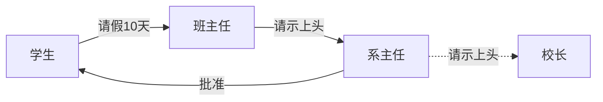

在现实生活中，常常会出现这样的事例：一个请求有多个对象可以处理，但每个对象的处理条件或权限不同。例如，公司员工请假，可批假的领导有部门负责人、副总经理、总经理等，但每个领导能批准的天数不同，员工必须根据自己要请假的天数去找不同的领导签名，也就是说员工必须记住每个领导的姓名、电话和地址等信息，这增加了难度。这样的例子还有很多，如找领导出差报销、生活中的“击鼓传花”游戏等。

在计算机软硬件中也有相关例子，如总线网中数据报传送，每台计算机根据目标地址是否同自己的地址相同来决定是否接收；还有异常处理中，处理程序根据异常的类型决定自己是否处理该异常；还有 Struts2 的拦截器、JSP 和 Servlet 的 Filter 等，所有这些，如果用责任链模式都能很好解决。



## 模式介绍
1. 举例说明
    规定学生请假小于或等于 2 天，班主任可以批准；小于或等于 7 天，系主任可以批准；小于或等于 10 天，院长可以批准；其他情况不予批准。

1. 意图目的
    为了避免请求发送者与多个请求处理者耦合在一起，将所有请求的处理者通过前一对象记住其下一个对象的引用而连成一条链；当有请求发生时，可将请求沿着这条链传递，直到有对象处理它为止。

1. 主要解决
     一个请求有多个对象可以处理，但每个对象的处理条件或权限不同。

1. 如何解决
    抽象处理者：定义一个处理请求的接口，包含抽象处理方法和一个后继连接。
    具体处理者：实现抽象处理者的处理方法，判断能否处理本次请求，如果可以处理请求则处理，否则将该请求转给它的后继者。例如上图中的班主任、系主任、校长。
    客户类：创建处理链，并向链头的具体处理者对象提交请求，它不关心处理细节和请求的传递过程。例如上图中的学生。

1. 关键代码
    具体处理者持有下一个处理者。

1. 何时使用
    有多个对象可以处理一个请求，哪个对象处理该请求由运行时刻自动确定。

    可动态指定一组对象处理请求，或添加新的处理者。

    在不明确指定请求处理者的情况下，向多个处理者中的一个提交请求。

1. 优点缺点
    增强了系统的可扩展性。可以根据需要增加新的请求处理类，满足开闭原则。

    责任分担。每个类只需要处理自己该处理的工作，不该处理的传递给下一个对象完成，明确各类的责任范围，符合类的单一职责原则。

    降低了对象之间的耦合度。该模式使得一个对象无须知道到底是哪一个对象处理其请求以及链的结构，发送者和接收者也无须拥有对方的明确信息。

    责任链简化了对象之间的连接。每个对象只需保持一个指向其后继者的引用，不需保持其他所有处理者的引用，这避免了使用众多的 if 或者 if···else 语句。

    不能保证每个请求一定被处理。由于一个请求没有明确的接收者，所以不能保证它一定会被处理，该请求可能一直传到链的末端都得不到处理。

    对比较长的职责链，请求的处理可能涉及多个处理对象，系统性能将受到一定影响。

1. 注意事项
    通常情况下，可以通过数据链表来实现职责链模式的数据结构。

1. 模式扩展
    纯的职责链模式：一个请求必须被某一个处理者对象所接收，且一个具体处理者对某个请求的处理只能采用以下两种行为之一：自己处理（承担责任）；把责任推给下家处理。

    不纯的职责链模式：允许出现某一个具体处理者对象在承担了请求的一部分责任后又将剩余的责任传给下家的情况，且一个请求可以最终不被任何接收端对象所接收。

1. 应用场景

## 代码实现
用责任链模式设计一个请假条审批模块。

假如规定学生请假小于或等于 2 天，班主任可以批准；小于或等于 7 天，系主任可以批准；小于或等于 10 天，院长可以批准；其他情况不予批准；这个实例适合使用职责链模式实现。

1、客户类。模拟学生向班主任请假10天。

```java
public class Client {
    public static void main(String[] args) {
        // 使用。学生向班主任请假10天。
        Leader leader = new ClassAdviser();
        leader.handlerRequest(11);
    }
}

请假时间过长，班主任无法处理请求！
请假时间过长，系主任无法处理请求！
院长处理了请求！
```

2、抽象处理者。

```java
public abstract class Leader {
    // 持有下一个处理者
    protected Leader nextLeader;

    public Leader(Leader nextLeader) {
        this.nextLeader = nextLeader;
    }

    // 处理请求
    protected abstract void handlerRequest(int leaveDays);
}
```

3、具体处理者，继承了抽象处理者。

```java
// 
public class ClassAdviser extends Leader {

    public ClassAdviser() {
        super(new DepartmentHead());
    }

    public void handlerRequest(int leaveDays) {
        if (leaveDays > 2) {
            System.out.println("请假时间过长，班主任无法处理请求！");
            if (nextLeader == null) {
                throw new UnsupportedOperationException("没有找到合适的处理者！！！");
            }
            nextLeader.handlerRequest(leaveDays);
            return;
        }
        System.out.println("班主任处理了请求");
    }
}

// 系主任
public class DepartmentHead extends Leader {

    public DepartmentHead() {
        super(new Dean());
    }

    protected void handlerRequest(int leaveDays) {
        if (leaveDays > 10) {
            System.out.println("请假时间过长，系主任无法处理请求！");
            if (nextLeader == null) {
                throw new UnsupportedOperationException("没有找到合适的处理者！！！");
            }
            nextLeader.handlerRequest(leaveDays);
            return;
        }
        System.out.println("系主任处理了请求");
    }
}

// 院长
public class Dean extends Leader {

    public Dean() {
        super(null);
    }

    protected void handlerRequest(int leaveDays) {
        System.out.println("院长处理了请求！");
    }
}
```

## JDK 中的责任链模式

## Spring 中的责任链模式