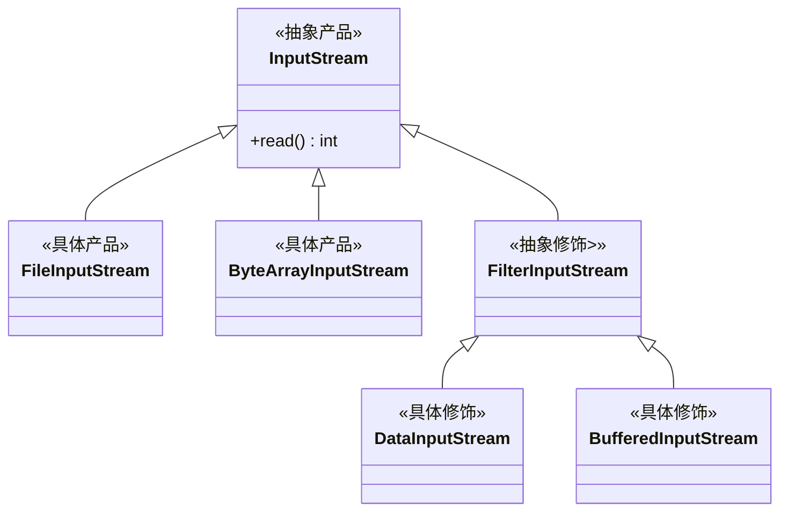

在现实生活中，常常需要对现有的产品增加新的功能或美化外观，例如房子装修，相片加相框。在软件开发中，有时想用一些现存的组件，这些组件可能只完成了一些核心功能。但是在不改变起结构的情况下，可以动态地扩展其功能。所有这些都可以采用装饰者模式来实现。

装饰者模式属于结构型模式，它通过类和接口直接的继承和引用实现创建复杂结构对象的功能。

## 模式介绍
1. 举例说明
    咖啡加糖、加牛奶。

    买陶瓷，先用塑料泡沫包扎，再用纸箱包装。

1. 意图目的
    在不改变现有对象结构的情况下，动态地给该对象增加一些额外功能。

1. 主要解决
    扩展一个类的功能时，采用继承的方式会产生大量的子类。

1. 如何解决
    在修饰者模式里面分为产品和装饰者 2 个角色。

    陶瓷是产品，塑料泡沫和纸箱是装饰者。

    装饰者继承子产品，然后持有一个产品。就是塑料泡沫里面包含者一个陶瓷。

    用户得到的产品，不管这个产品是否附加了装饰。

    装饰者的本质是使用组合关系来代替继承关系实现扩展类的功能。

1. 关键代码
    装饰者继承子产品。

    装饰者里面引用一个产品。

    一个产品，多个修饰者。

1. 何时使用
    当对象的功能要求可以动态地添加，也可以再动态地撤销时。

    当需要通过对现有的一组基本功能进行排序组合生成非常多的功能，采用继承关系很难实现，而采用装饰者模式却很好实现。

    当需要给一个现有类增加新的功能，而又不能采用生成子类的方法进行扩展时。例如：该类被隐藏或者采用继承会生成大量的子类。

1. 优点缺点
    开闭原则。

    可以动态的给类添加新的功能。

    装饰模式会添加许多子类，如果过度使用会使得程序变得复杂。

1. 注意事项

1. 使用场景
    Java IO 体系。

## 代码实现
用户端使用效果。
```java
public class Demo {
    public static void main(String[] args) {
        // 购买长黑咖啡
        Drink drink = new LongBlack();
        // 添加牛奶调料
        drink = new Milk(drink);
        // 添加巧克力调料
        drink = new Chocolate(drink);

        // 打印账单
        System.out.println(drink.bill());
    }
}
巧克力：2.0 && 牛奶：3.0 && 长黑咖啡：20.0
```

1、创建主体角色及其子类。

```java
/**
 * 主体类
 */
@Data
public abstract class Drink {
    private String name;

    private Float price;

    public Drink(String name, Float price) {
        this.name = name;
        this.price = price;
    }

    /**
      * 打印订单信息，由子类实现
      */
    public abstract String bill();
}

/**
 * 主体实现，这里多一层封装。
 */
@Data
@EqualsAndHashCode(callSuper = true)
public class Coffee extends Drink {

    protected Coffee(String name, Float price) {
        super(name, price);
    }

    @Override
    public String bill() {
        return super.getName() + "：" + super.getPrice();
    }
}

/**
 * 具体产品
 */
public class LongBlack extends Coffee {

    public LongBlack() {
        super("长黑咖啡", 20f);
    }
}

public class Espresso extends Coffee {

    public Espresso() {
        super("浓缩咖啡", 30f);
    }
}
```

2、创建修饰者角色及其实现。

```java
/**
 * 调料抽象类，作为修饰者
 */
@Data
@EqualsAndHashCode(callSuper = true)
public abstract class Spices extends Drink {

    private Drink obj;

    protected Spices(String name, Float price, Drink obj) {
        super(name, price);
        this.obj = obj;
    }

    @Override
    public String bill() {
        return super.getName() + "：" + super.getPrice() + " && " + obj.bill();
    }
}

public class Milk extends Spices {

    public Milk(Drink obj) {
        super("牛奶", 3f, obj);
    }
}

public class Chocolate extends Spices {

    public Chocolate(Drink obj) {
        super("巧克力", 2f, obj);
    }
}
```

3、模拟新增一个无因咖啡。

```java
public class Decaf extends Coffee {

    public Decaf() {
        super("无因咖啡", 15f);
    }
}

public class Demo {
    public static void main(String[] args) {
        // 购买无因咖啡
        Drink drink = new Decaf();
        // 添加牛奶调料
        drink = new Milk(drink);

        // 添加巧克力调料
        drink = new Chocolate(drink);

        // 打印账单
        System.out.println(drink.bill());
    }
}

巧克力：2.0 && 牛奶：3.0 && 无因咖啡：15.0
```

## JDK 中的装饰者模式

JDK 中的 IO 结构就使用了装饰者模式。
1. `InputStream` 是抽象产品。
1. `FileInputStream` 是具体产品。
1. `FilterInputStream` 是抽象装饰。
1. `DataInputStream`、`BufferInputStream` 是具体装饰。



```java
/* 1. 获取产品
 * 2. 修饰产品
 * 3. 得到最终产品
 */
InputStream ios = new FileInputStream("/user/test.txt");
ios = new DataInputStream(ios);
System.out.println(ios.read());

// 抽象产品
public abstract class InputStream implements Closeable {
    public abstract int read() throws IOException;
}

// 具体产品
public class FileInputStream extends InputStream {
}

// 抽象修饰
public class FilterInputStream extends InputStream {
    protected volatile InputStream in;
}

// 具体修饰
public class DataInputStream extends FilterInputStream implements DataInput {
    public DataInputStream(InputStream in) {
        super(in);
    }
}
```