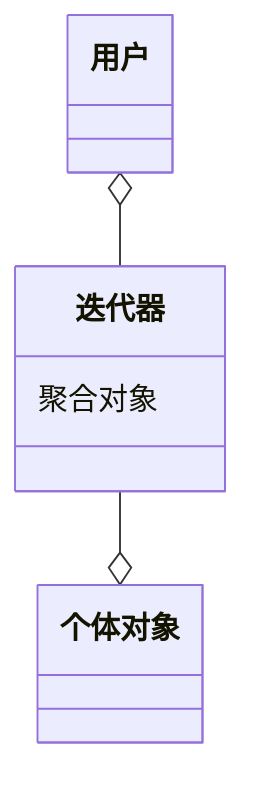

在现实生活以及程序设计中，经常要访问一个聚合对象中的各个元素，如“数据结构”中的链表遍历，通常的做法是将链表的创建和遍历都放在同一个类中，但这种方式不利于程序的扩展，如果要更换遍历方法就必须修改程序源代码，这违背了 “开闭原则”。

既然将遍历方法封装在聚合类中不可取，那么聚合类中不提供遍历方法，将遍历方法由用户自己实现是否可行呢？答案是同样不可取，因为这种方式会存在两个缺点：
1. 暴露了聚合类的内部表示，使其数据不安全。
1. 增加了客户的负担。

**迭代器模式**能较好地克服以上缺点，它在客户访问类与聚合类之间插入一个迭代器，这分离了聚合对象与其遍历行为，对客户也隐藏了其内部细节，且满足**单一职责原则**和**开闭原则**，如 Java 中的 `Collection`、`List`、`Set`、`Map` 等都包含了迭代器。

## 模式介绍
迭代器模式提供一个对象来顺序访问聚合对象中的一系列数据，而不暴露聚合对象的内部表示。迭代器模式属于对象行为型模式，通过类之间不同的通信方式实现不同的行为方式。

#### 举例说明

#### 主要解决

#### 模式原理
迭代器模式主要包含以下角色：
1. 抽象聚合：定义存储、添加、删除聚合对象以及创建迭代器对象的接口。
1. 具体聚合：实现抽象聚合类，返回一个具体迭代器的实例。
1. 抽象迭代器：定义访问和遍历聚合元素的接口，通常包含 hasNext()、first()、next() 等方法。
1. 具体迭代器：实现抽象迭代器接口中所定义的方法，完成对聚合对象的遍历，记录遍历的当前位置。



#### 关键代码

#### 应用场景
迭代器模式通常在以下几种情况使用：
1. 当需要为聚合对象提供多种遍历方式时。
1. 当需要为遍历不同的聚合结构提供一个统一的接口时。
1. 当访问一个聚合对象的内容而无须暴露其内部细节的表示时。

#### 优点缺点
迭代器的主要优点如下：
1. 访问一个聚合对象的内容而无须暴露它的内部表示。
1. 遍历任务交由迭代器完成，这简化了聚合类。
1. 它支持以不同方式遍历一个聚合，甚至可以自定义迭代器的子类以支持新的遍历。
1. 增加新的聚合类和迭代器类都很方便，无须修改原有代码。
1. 封装性良好，为遍历不同的聚合结构提供一个统一的接口。

其主要缺点是：增加了类的个数，这在一定程度上增加了系统的复杂性。

#### 实际使用

#### 注意事项
由于聚合与迭代器的关系非常密切，所以大多数语言在实现聚合类时都提供了迭代器类，因此大数情况下使用语言中已有的聚合类的迭代器就已经够了。

#### 模式扩展
迭代器模式常常与组合模式结合起来使用，在对组合模式中的容器构件进行访问时，经常将迭代器潜藏在组合模式的容器构成类中。

## 代码实现
用迭代器模式编写一个浏览婺源旅游风景图的程序。

分析：婺源的名胜古迹较多，要设计一个查看相关景点简介的程序，用“迭代器模式”设计比较合适。

首先，设计一个婺源景点（WyViewSpot）类来保存每张图片的名称与简介；再设计一个景点集（ViewSpotSet）接口，它是抽象聚合类，提供了增加和删除婺源景点的方法，以及获取迭代器的方法。

然后，定义一个婺源景点集（WyViewSpotSet）类，它是具体聚合类，用 ArrayList 来保存所有景点信息，并实现父类中的抽象方法；再定义婺源景点的抽象迭代器（ViewSpotltemtor）接口，其中包含了查看景点信息的相关方法。

最后，定义婺源景点的具体迭代器（WyViewSpotlterator）类，它实现了父类的抽象方法；客户端程序设计成窗口程序，它初始化婺源景点集（ViewSpotSet）中的数据，并实现 ActionListener 接口，它通过婺源景点迭代器（ViewSpotlterator）来査看婺源景点（WyViewSpot）的信息。图 2 所示是其结构图。

#### 客户端
```java
public class Client {

    public static void main(String[] args) {
        Set<ViewSpot> viewSpots = new HashSet<>();

        viewSpots.add(new ViewSpot("江湾", "江湾景区是婺源的一个国家5A级旅游景区"));
        viewSpots.add(new ViewSpot("李坑", "李坑村是一个以李姓聚居为主的古村落"));
        viewSpots.add(new ViewSpot("晓起村", "晓起有“中国茶文化第一村”与“国家级生态示范村”之美誉"));
        viewSpots.add(new ViewSpot("菊径村", "菊径村形状为山环水绕型，小河成大半圆型，绕村庄将近一周"));

        Iterator<ViewSpot> iterator = viewSpots.iteraotr();
        while (iterator.hasNext()) {
            ViewSpot viewSpot = iterator.next();
            System.out.println(viewSpot.getName());
        }
    }
}

@Data
@AllArgsConstructor
public class ViewSpot {

    private String name;

    private String introduce;
}
```

输出：

```
江湾
李坑
晓起村
菊径村
```
#### 聚合角色
迭代器定义访问和遍历聚合元素的接口，通常包含 `hasNext()`、`first()`、`next()` 等方法。我们将具体迭代器放在聚合类中，方便使用。

```java
/**
 * 抽象聚合
 */
public interface Set<T> {

    void add(T t);

    T get(int index);

    T remove(int index);

    Iterator<T> iteraotr();
}

/**
 * 具体聚合，具体迭代器作为内部类
 */
public class HashSet<T> implements Set<T> {

    private List<T> objs;

    @Override
    public void add(T t) {
        if (objs == null)
            objs = new ArrayList<>();
        objs.add(t);
    }

    @Override
    public T get(int index) {
        if (objs == null)
            return null;

        return objs.get(index);
    }

    @Override
    public T remove(int index) {
        if (objs == null)
            return null;

        return objs.remove(index);
    }

    @Override
    public Iterator<T> iteraotr() {
        return new Itr();
    }

    /**
     * 自定义的迭代器
     */
    private class Itr implements Iterator<T> {

        private int currentIndex;

        @Override
        public Boolean hasNext() {
            return objs.size() > currentIndex;
        }

        @Override
        public T first() {
            return objs.get(0);
        }

        @Override
        public T prev() {
            currentIndex--;
            return objs.get(currentIndex + 1);
        }

        @Override
        public T next() {
            currentIndex++;
            return objs.get(currentIndex - 1);
        }

        @Override
        public T last() {
            return objs.get(objs.size() - 1);
        }
    }
}
```

## 迭代器
```java
/**
 * 抽象迭代器
 */
public interface Iterator<T> {
    Boolean hasNext();

    /**
     * 第一个元素
     */
    T first();

    /**
     * 上一个元素
     */
    T prev();

    /**
     * 下一个元素
     */
    T next();

    /**
     * 最后的元素
     */
    T last();
}
```

## JDK 中的迭代器模式

## Spring 中的迭代器模式