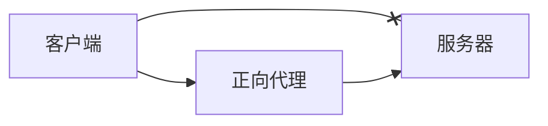
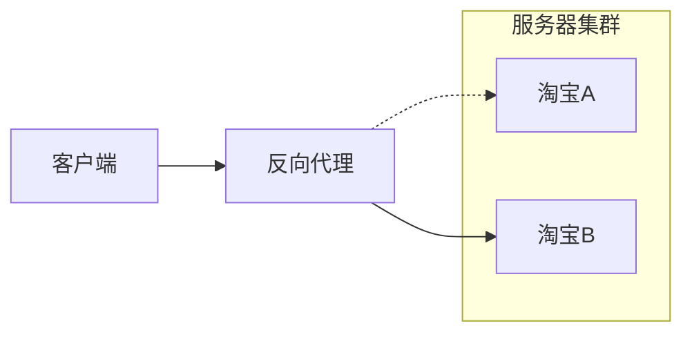

反向代理服务器决定那台服务器提供服务。

## 正向代理
正向代理类似一个跳板机，代理访问外部资源。

举个例子：我是一个用户，我访问不了某网站，但是我能访问一个代理服务器，这个代理服务器呢,他能访问那个我不能访问的网站，于是我先连上代理服务器,告诉他我需要那个无法访问网站的内容，代理服务器去取回来,然后返回给我。从网站的角度，只在代理服务器来取内容的时候有一次记录，有时候并不知道是用户的请求，也隐藏了用户的资料，这取决于代理告不告诉网站。




正向代理的用途：
1. 访问原来无法访问的资源，如 google。
1. 可以做缓存，加速访问资源。
1. 对客户端访问授权，上网进行认证。
1. 代理可以记录用户访问记录（上网行为管理），对外隐藏用户信息。

## 反向代理
反向代理是指以代理服务器来接受 Internet 上的连接请求，然后将请求转发给内部网络上的服务器，并将从服务器上得到的结果返回给 Internet 上请求连接的客户端，此时代理服务器对外就表现为一个服务器。客户端是无感知代理的存在的，反向代理对外都是透明的，访问者者并不知道自己访问的是一个代理。因为客户端不需要任何配置就可以访问。



反向代理的作用：
1. 负载均衡，通过反向代理服务器来优化网站的负载。
1. 保证内网的安全，可以使用反向代理提供 WAF 功能，阻止 Web 攻击。

## Nginx 实现反向代理
```conf
server {
    listen       80;
    listen  [::]:80;
    server_name  localhost;

    # tomcat首页
    location /index {
        proxy_pass http://ncthz.top:8081/;
    }

    # 毕设前台首页
    location ^~ /CR/ {
        proxy_pass http://ncthz.top:8080/CR/;
    }
    # 毕设后台首页
    location / {
        proxy_pass http://ncthz.top:8080/CRAdmin/;
    }
}
```

## 面试题
1、请解释代理中的正向代理和反向代理。